## Allegro Extensions
To rozszerzenie usprawnia pracę z Allegro dodając brakujące funkcjonalności i automatyzując niektóre czynności. Składa się z wielu modułów, które mogą być włączane w zależności od potrzeb.

Jest to rozszerzenie do przeglądarki Chrome. Wszystkie rozszerzenia testuję tylko dla systemu Windows 10 i najnowszej wersji przeglądarki.

**Na wstępie pragnę zaznaczyć że nie odpowiadam za żadne problemy wynikłe z użytkowania tego rozszerzenia. Z wielu funkcjonalności po prostu nie korzystam - np. z zestawów produktów, wznawiania ofert z pełnym zestawem przedmiotów, nadawania wielu przesyłek jednocześnie itp. tak więc nie wiem jak zachowa się ono w określonych sytuacjach.**

Jeśli pracujesz na wielu komputerach, miej na uwadze że rozszerzenie nie synchronizuje swojego działania między nimi, wszelkie dane są zapisywane lokalnie na danym komputerze.

**Instrukcja instalacji:**
1. Pobierz rozszerzenie "allegro_extensions.zip" z listy plików widocznej powyżej i rozpakuj je tam gdzie zamierzasz je trzymać.
2. Kliknij ikonę menu rozszerzeń w prawym górnym rogu okna przeglądarki (ikona puzzla)  lub z menu przeglądarki wybierz "Rozszerzenia - Zarządzaj rozszerzeniami".
3. Włącz "Tryb dewelopera" w prawym górnym rogu okna przeglądarki 
4. Kliknij przycisk "Załaduj rozpakowane"  

5. Wybierz folder z uprzednio pobranym i rozpakowanym rozszerzeniem.
6. Po załadowaniu rozszerzenia otworzy się strona jego opcji, gdzie będziesz mógł włączyć poszczególne moduły. Część z nich nie wymaga dostępu do API, są to moduły: 
	- Zmiana koloru ikony FV
	- Automatyczne pobieranie i drukowanie etykiet adresowych
	- Wypełnianie wagi i wielkości przesyłki
	- Szybkie przełączanie sposobu nadawania przesyłek InPost
	- Wykrywanie błędów w danych adresowych

	Pozostałe moduły korzystają z API, aby ich używać wymagane będzie uzupełnienie danych Client ID i Client Secret. Uzyskasz je rejestrując aplikację na stronie [apps.developer.allegro.pl](https://apps.developer.allegro.pl/)
	

	
Instrukcja rejestracji aplikacji

	
	1. Otwórz stronę [developer.allegro.pl](https://developer.allegro.pl/).
	2. Kliknij "Zarządzaj API" - "Moje aplikacje". Upewnij się że zalogowany jesteś na konto Allegro w ramach którego działać będzie aplikacja. Jeśli nie, wyloguj się (klikając ikonę obok nazwy użytkownika i wybierz "Wyloguj") a następnie zaloguj się na właściwe konto.
	3. Kliknij przycisk "Zarejestruj aplikację".  
	4. W formularzu rejestracji aplikacji Allegro podaj następujące dane:
		- **Nazwa aplikacji:** dowolna, np. "Allegro Extensions"
		- **Wybierz rodzaj aplikacji:** zaznacz pierwszą opcję - "Aplikacja ma dostęp do przeglądarki, w której użytkownik loguje się do Allegro (np. aplikacja na serwerze albo plik wykonywalny)"  
		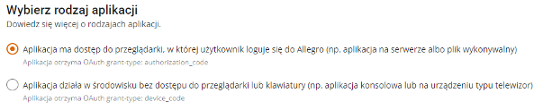
		- **Ścieżka aplikacji:** na stronie opcji rozszerzenia zaznacz i skopiuj tekst widniejący przy parametrze **Ścieżka aplikacji**. Jest to unikalny adres aplikacji w domenie chromiumapp.org pod który Allegro będzie przesyłać kod autoryzujący i tokeny dostępowe.
		- **Uprawnienia aplikacji:** przy każdym module korzystającym z API podane są wymagane uprawnienia. Zaznacz te z których będziesz korzystać oraz `allegro:api:profile:read` (sekcja **Dane osobowe**). Jeśli już po zalogowaniu włączysz moduł korzystający z dodatkowych uprawnień, nie zaznaczonych wcześniej, będzie wymagana edycja zarejestrowanej aplikacji na stronie [apps.developer.allegro.pl](https://apps.developer.allegro.pl/) i zaznaczenie tych uprawnień oraz ponowne kliknięcie przycisku "Zaloguj" na stronie opcji rozszerzenia.
		- Zaznacz `* Znam i akceptuję regulamin REST API Allegro`.
		- Kliknij przycisk "Zarejestruj".
		- Na koncie możesz mieć do 5 zarejestrowanych aplikacji. Jeżeli chciałbyś ją usunąć zrobisz to na tej samej stronie.
	5. Aplikacja zostanie zarejestrowana. Kliknij "Szczegóły" aby odczytać Client ID i Client Secret. Zaznacz i skopiuj parametr Client ID, wklej go na stronie opcji rozszerzenia w polu Client ID. Kliknij "Pokaż" przy parametrze Client Secret, aby odsłonić domyślnie zamaskowaną wartość tego parametru, zaznacz i skopiuj parametr Client Secret, wklej go na stronie opcji rozszerzenia w polu Client Secret. Zamknij okno ze szczegółami aplikacji.
	6. Kliknij "Zapisz" a następnie "Zaloguj" na stronie opcji rozszerzenia. Zostaniesz przeniesiony na stronę Allegro gdzie musisz potwierdzić że kontynuujesz jako zalogowany użytkownik  
	
	7. Kliknij przycisk "Kontynuuj".
	8. Zostaniesz przeniesiony na stronę Allegro z pytaniem czy chcesz powiązać swoje konto z aplikacją  
	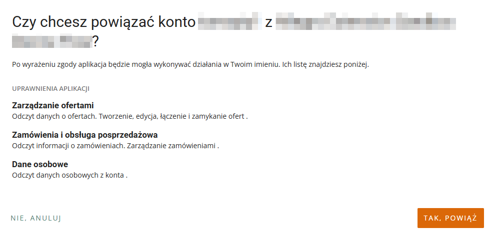
	9. Kliknij przycisk "Tak, powiąż konto". Jeśli chiałbyś usunąć powiązanie aplikacji z kontem zrobisz to na stronie Allegro - Moje Allegro - Konto - Bezpieczeństwo - [Powiązane aplikacje](https://allegro.pl/moje-allegro/moje-konto/powiazane-aplikacje)
	10. Na stronie opcji rozszerzenia pojawi się komunikat o zalogowaniu wraz z nazwą użytkownika.  
	

7. Jeżeli miałeś otwartą stronę Sales Center, odśwież ją, celem załadowania rozszerzenia. Sporadycznie może zdarzyć się, że rozszerzenie nie załaduje się przy wejściu na stronę Sales Center, najlepiej wtedy odświeżyć stronę (<kbd>Ctrl</kbd> + <kbd>F5</kbd>), ewentualnie załadować ponownie rozsrzerzenie  
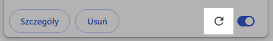  
po czym koniecznie musisz odświeżyć wszystkie otwarte karty Sales Center (lub zamknąć je i otworzyć od nowa).

Rozszerzenie możesz sprawdzić w serwisie testowym [Allegro Sandbox](https://developer.allegro.pl/tutorials/informacje-podstawowe-b21569boAI1#srodowisko-testowe).  

Instrukcja rejestracji aplikacji dla serwisu testowego

Uzyskanie danych dostępowych dla serwisu testowego jest trochę bardziej skomplikowane niż dla normalnego Allegro. Powodem jest to że rozszerzenie nie może uzyskać tokenów dostępowych w taki sam sposób, choć jakiś czas temu było to jeszcze możliwe więc zmiana zaszła albo po stronie Allegro albo przy którejś wersji Chrome. Kontaktowałem się z obsługą na stronie GitHub Allegro jednak oni nie widzą problemu, poza tym nie wspierają konkretnych języków programowania a ponieważ raczej nikt nie pisze rozszerzeń do przeglądarki Chrome działających z Allegro tylko tworzy się serwisy lub zewnętrzne aplikacje działające w inny sposób i tam ten problem nie występuje to nie będą drążyć tematu.

Trzeba było więc sobie jakoś z tym poradzić więc stworzyłem zewnętrzną aplikację pośredniczącą w uzyskiwaniu tokenów dostępowych do serwisu Allegro Sandbox. Zdaję sobie sprawę że nie każdy posiada serwer z obsługą Node.js dlatego działa ona jako aplikacja w ramach konta Google które większość osób i tak posiada albo może bez problemu założyć.

1. Przejdź na stronę [script.google.com](https://script.google.com/).
2. Kliknij "Ustawienia" - "Google Apps Script API" - włącz.
3. Kliknij "Nowy projekt". Otworzy się edytor domyślnego pliku "Kog.gs". Zmień nazwę projektu z "Projekt bez nazwy" na np. "Allegro".
4. Otwórz plik "Kod.js" z listy plików na górze tej strony i skopiuj jego zawartość.
5. Usuń z edytora obecną zawartość pliku i wklej skopiowany tekst. Zapisz wciskając <kbd>Ctrl</kbd> + <kbd>s</kbd>.
6. Kliknij "Wdróż" - "Nowe wdrożenie".
7. Kliknij ikonę kółka zębatego i wybierz "Aplikacja internetowa". Pole "Opis" nie jest wymagane, parametr "Wykonaj jako": "Ja (adres konta Google)", "Kto ma dostęp" zmień na "Każdy". Kliknij "Wdróż"  
	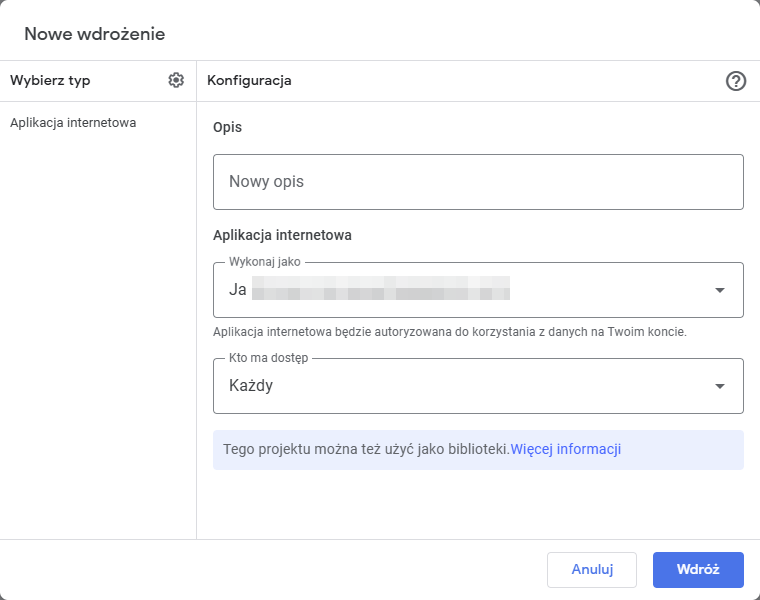
8. Pojawi się komunikat o konieczności udzielenia dostępu do aplikacji internetowej. Kliknij przycisk "Udziel dostępu", wybierz konto Google, pojawi się kolejny komunikat informujący o tym że aplikacja nie jest zweryfikowana. Kliknij "Zaawansowane", następnie "Otwórz Allegro (niebezpieczne)" (gdzie "Allegro" to nazwa aplikacji nadana wcześniej w edytorze)  
	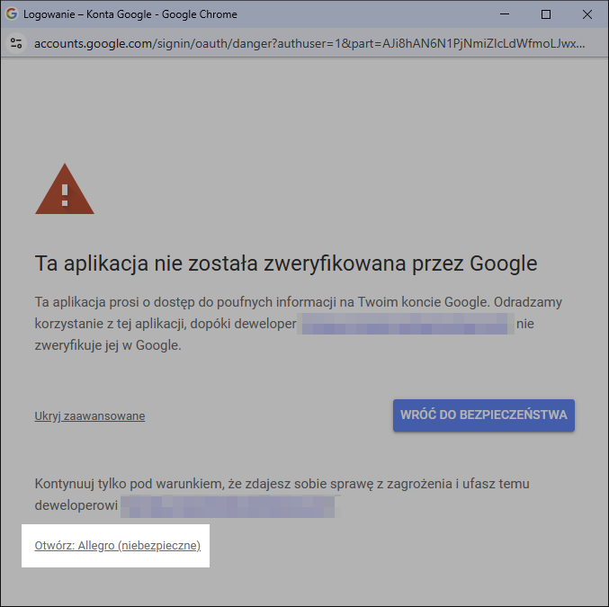
9. W kolejnym komunikacie pojawi się informacja że aplikacja chce uzyskać dostęp do konta Google w zakresie łączenia się z usługą zewnętrzną. Kliknij "Zezwól"  
	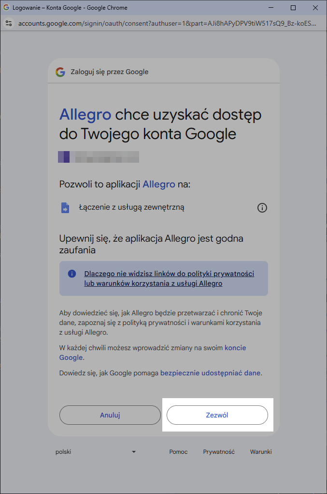

	Jeśli chciałbyś usunąć udzielony dostęp do konta Google zrobisz to w ustawieniach konta, sekcja "Bezpieczeństwo" - "Twoje połączenia z aplikacjami i usługami innych firm".
10. Na stronie wdrożenia pojawi się komunikat ze szczegółami wdrożenia, z których istotnym parametrem jest link - aplikacja internetowa. Skopiuj go i wklej na stronie opcji rozszerzenia do pola "Adres aplikacji internetowej" 
  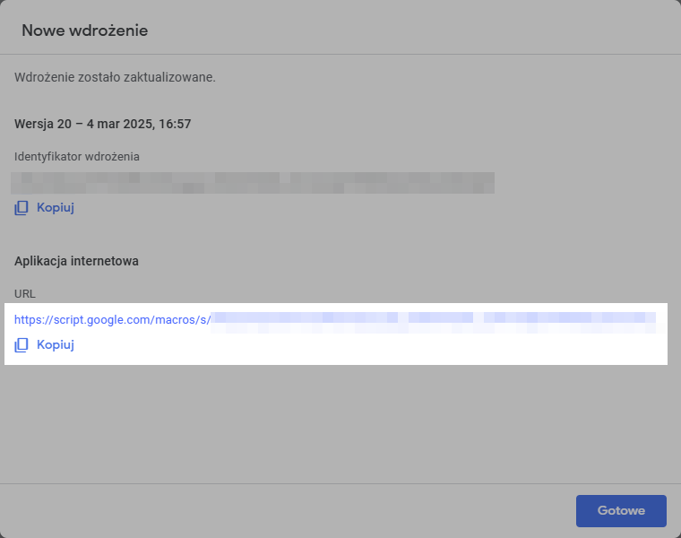  
11. Przejdź na stronę [developer.allegro.pl](https://developer.allegro.pl/).
12. Kliknij "Zarządzaj API" - "Moje aplikacje (sandbox)". Upewnij się że zalogowany jesteś na konto Allegro (sandbox) w ramach którego działać będzie aplikacja. Jeśli nie, wyloguj się (klikając ikonę obok nazwy użytkownika i wybierz "Wyloguj") a następnie zaloguj się na właściwe konto.
13. Kliknij przycisk "Zarejestruj aplikację".
14. W formularzu rejestracji aplikacji Allegro podaj następujące dane:
	- **Nazwa aplikacji:** dowolna, np. "Allegro Extensions"
	- **Wybierz rodzaj aplikacji:** zaznacz drugą opcję ("Aplikacja działa w środowisku bez dostępu do przeglądarki lub klawiatury (np. aplikacja konsolowa lub na urządzeniu typu telewizor)")  
	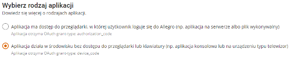
	- **Uprawnienia aplikacji:** zaznacz następujące uprawnienia: `allegro:api:sale:offers:read` `allegro:api:sale:offers:write` (sekcja **Zarządzanie ofertami**), `allegro:api:profile:read` (sekcja **Dane osobowe**).
	- Zaznacz `* Znam i akceptuję regulamin REST API Allegro`.
	- Kliknij przycisk "Zarejestruj".
	- Na koncie możesz mieć do 5 zarejestrowanych aplikacji. Jeżeli chciałbyś ją usunąć zrobisz to na tej samej stronie.
15. Aplikacja zostanie zarejestrowana. Kliknij "Szczegóły" aby odczytać Client ID i Client Secret. Zaznacz i skopiuj parametr Client ID, wklej go na stronie opcji rozszerzenia w polu Client ID. Kliknij "Pokaż" przy parametrze Client Secret, aby odsłonić domyślnie zamaskowaną wartość tego parametru, zaznacz i skopiuj parametr Client Secret, wklej go na stronie opcji rozszerzenia w polu Client Secret. Zamknij okno ze szczegółami aplikacji.
16. Kliknij "Zapisz" a następnie "Zaloguj" na stronie opcji rozszerzenia. Zostaniesz przeniesiony na stronę Allegro gdzie musisz wprowadzić kod podany przez aplikację (kod uzupełni się automatycznie)  
	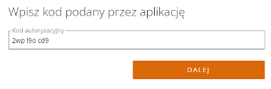
17. Kliknij przycisk "Dalej". Zostaniesz przeniesiony na stronę Allegro gdzie musisz potwierdzić że kontynuujesz jako zalogowany użytkownik  
	
18. Kliknij przycisk "Kontynuuj". Zostaniesz przeniesiony na stronę Allegro z pytaniem czy chcesz powiązać swoje konto z aplikacją  
	
19. Kliknij przycisk "Tak, powiąż konto". Jeśli chiałbyś usunąć powiązanie aplikacji z kontem zrobisz to na stronie Allegro - Moje Allegro - Konto - Bezpieczeństwo - [Powiązane aplikacje](https://allegro.pl.allegrosandbox.pl/moje-allegro/moje-konto/powiazane-aplikacje)
20. Na stronie opcji rozszerzenia pojawi się komunikat o zalogowaniu wraz z nazwą użytkownika.  

***

## Opis poszczególnych modułów

### Zmiana koloru ikony faktury VAT

Służy do zmiany koloru ikony faktury VAT z domyślnego szarego, który nie wyróżnia się szczególnie na liście zamówień w Sales Center, na dowolny. Dzięki temu łatwiej dostrzec że do danego zamówienia ma być wystawiona faktura a nie paragon.

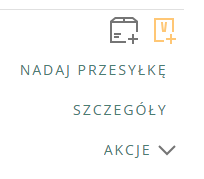

Domyślnie do wyboru jest kilkanaście predefiniowanych kolorów, ale można też wybrać dowolny, przy czym wymagana będzie wtedy dodatkowa czynność - szczegóły po wybraniu koloru spoza palety domyślnych.
   
  
### Automatyczne pobieranie i drukowanie etykiet adresowych  

Upraszcza i skraca czas potrzebny na pobranie i wydrukowanie etykiety adresowej. Po kliknięciu "Nadaj przesyłkę" zamiast wykonywania kilku czynności:

- kliknięcie przycisku "Zapisz"
- kliknięcie przycisku "Zamów przesyłki"
- rozwinięcie menu i wybranie pozycji "Pobierz etykietę"
- otwarcie pobranej etykiety
- wydruk etykiety
- zamknięcie pobranej etykiety
- usunięcie pobranej etykiety

wystarczy kliknięcie przycisku "Zapisz i drukuj". Wszystkie te czynności zostaną wykonane automatycznie, bez zbędnej zwłoki i angażowania twojej uwagi, w międzyczasie możesz zająć się czymś innym, np. zaklejaniem paczki.

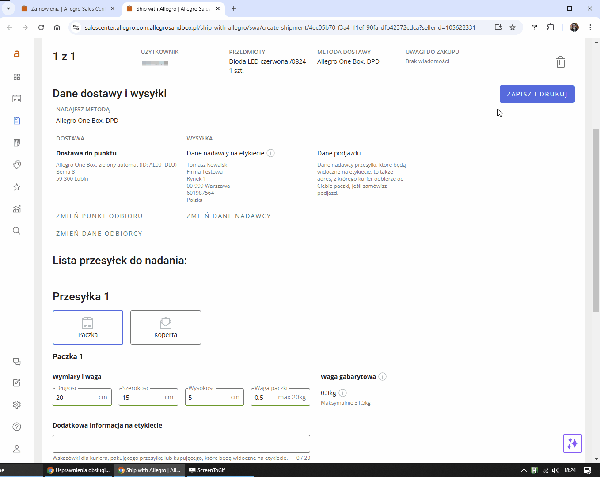

Moduł ten wymaga dwóch dodatkowych programów:

- SumatraPDF: program do obsługi plików PDF z opcją drukowania z wiersza poleceń, do pobrania [tutaj](https://www.sumatrapdfreader.org/download-free-pdf-viewer)
- allegro_extensions.exe: program łączący to rozszerzenie z systemem operacyjnym użytkownika - celem wykrywania listy drukarek i drukowania pobranych etykiet za pomocą programu SumatraPDF, do pobrania z listy plików widocznej powyżej jako "allegro_extensions_drukowanie.zip" 

Przed aktywowaniem tego modułu zainstaluj program SumatraPDF oraz uruchom program "allegro_extensions.exe"

Pojawi się informacja o tym że program nie jest zarejestrowany w systemie

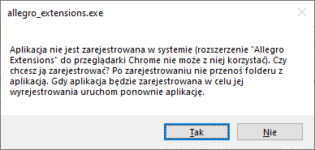

Kliknij "Tak". Pojawi się kolejne pytanie o ID rozszerzenia

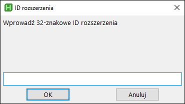

Jest ono unikalne, znajdziesz je na stronie rozszerzeń

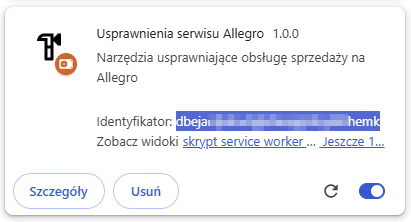

Zaznacz i skopiuj ten identyfikator, wklej go i kliknij OK. Otrzymasz potwierdzenie zarejestrowania aplikacji w systemie

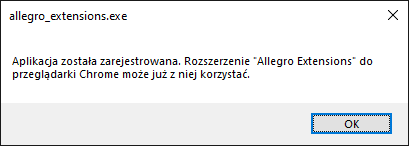

Po wykonaniu tych czynności możesz włączyć moduł na stronie opcji rozszerzenia. Wskaż drukarkę która będzie służyć do wydruku etykiet adresowych. Ścieżka do programu SumatraPDF, jeśli został zainstalowany w domyślnej lokalizacji, uzupełni się automatycznie. Jeśli nie - wskaż ją we właściwym polu i kliknij "Zapisz".

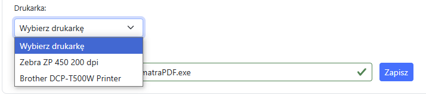

Po kliknięciu przycisku "Nadaj przesyłkę" na liście zamówień w Sales Center w formularzu nadawania przesyłki pojawią się dwa przyciski "Zapisz i drukuj", na górze oraz na dole strony, obok przycisku "Zapisz". Przycisk na górze przydaje się zwłaszcza na małych monitorach żeby nie trzeba było przewijać strony na dół.

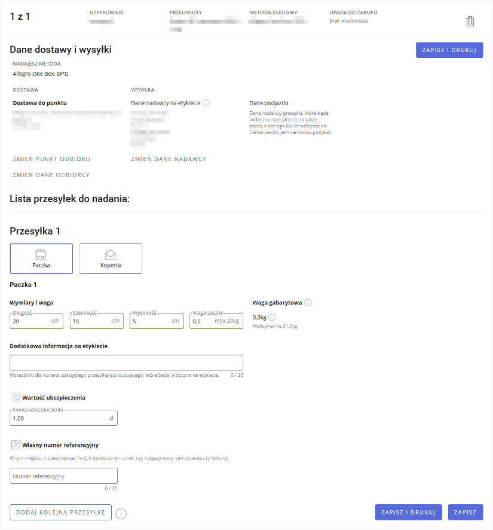

Po kliknięciu tego przycisku wszystkie czynności związane z pobieraniem i wydrukiem etykiety zostaną wykonane automatycznie. Sporadycznie może się zdarzyć, że program nie wykryje zakończenia momentu pobierania - pojawi się wtedy okno z komunikatem "Nie wykryto zakończenia pobierania w sposób automatyczny w ustalonym okresie czasu. Ostatnio znaleziony pobrany plik to (nazwa pliku). Upewnij się że jest to plik z etykietą którą chcesz wydrukować a nie plik wcześniejszy. Czy wydrukować?" Sprawdź czy jest to etykieta którą chcesz wydrukować i zatwierdź. Zauważyłem że dzieje się to głównie wtedy gdy strona Allegro trochę zwalnia z powodu obciążenia (koło godz. 14-15) albo przy wydruku pierwszej etykiety po uruchomieniu komputera. Raz na jakiś czas (co miesiąc albo nawet rzadziej) warto kliknąć "Wyczyść wszystko" na stronie historii pobierania.

Aby uniknąć omyłkowego wydruku tej samej etykiety, po wydruku przycisk "Nadaj etykietę" na stronie Sales Center przy danym zamówieniu zostanie zablokowany.
   
  
### Wypełnianie wagi i wielkości przesyłki

Pozwala automatycznie wypełnić pola dotyczące wielkości przesyłki (lub zaznaczyć odpowiednią wielkość). Definiowane osobno dla każdej formy dostawy. Dla przesyłek których wymiary podaje się ręcznie, nie z wybieralnej listy, dodaje dodatkowo opcje do 9 szablonów których kliknięcie szybko wstawi dane wartości do pól dotyczących wielkości przesyłki. Ponadto długie przytrzymanie przycisku danego szablonu (lub wybieralnej predefiniowanej opcji) oznaczy ten szablon (tą opcję) jako domyślną.

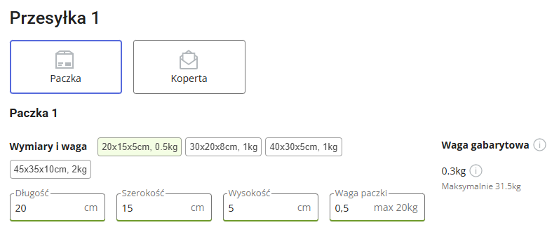

Moduł ten działa tylko dla pojedynczych przesyłek, nie wypełni wartości jeśli korzystasz z przycisku "Dodaj kolejną przesyłkę".

Na stronie opcji rozrzerzenia trzeba skonfigurować wartości domyślne. W przypadku wartości których wymiary podaje się w polach długość, szerokość, wysokość i waga - należy wpisać je w odpowiednich polach i kliknąć "Zapisz", lub dodać kolejne szablony jeśli planujemy korzystać z większej liczby rozmiarów przesyłek przy nadawaniu. W momencie zapisywania szablon który był zaznaczony staje się szablonem domyślnym. W przypadku przesyłek które posiadają predefiniowane wymiary - należy zaznaczyć domyślną opcję i kliknąć "Zapisz".

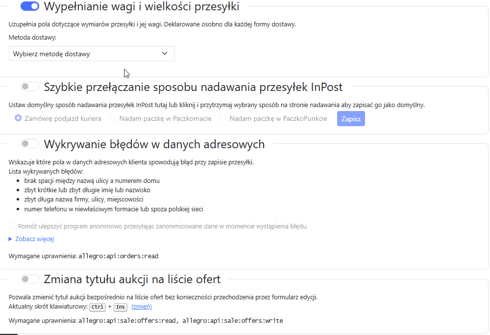

Na liście metod dostawy dodane są najpopularniejsze opcje dostawy. Ograniczenia dotyczące wartości maksymalnych i minimalnych dla danych form dostawy mogą się okresowo zmieniać, jeśli wpiszesz wartości które przy wprowadzaniu w ustawieniach mieściły się w dopuszczalnym przedziale ale przy nadawaniu dają błąd za mały lub za duży wymiar - daj znać, postaram się je poprawić. Można dodawać nowe metody, których nie ma ma liście, wybierając wartość "Dodaj nową". Następnie należy wybrać czy będzie to metoda dostawy w której podaje się wartości numeryczne pól długość, szerokość, wysokość i waga, czy wybiera się z listy. 

W przypadku wartości numerycznych, postępuj tak jak wcześniej przy uzupełnianiu domyślnych wartości.

W przypadku wartości predefiniowanych, rozwiń menu klikając strzałkę obok przycisku "Zapisz" i wybierz "Dodaj wybieralną pozycję". W formularzu "Wysyłam z Allegro" zaznacz nazwę przy danej predefiniowanej wartości, skopiuj ją

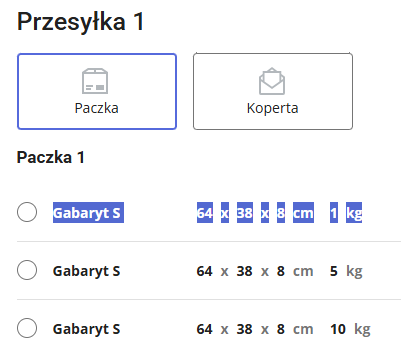

a następnie kliknij tekst "Kliknij tutaj aby wkleić ze schowka skopiowany tekst". Tak naprawdę wklejona nazwa nie ma znaczenia - liczy się która w kolejności jest to pozycja. Moduł nie zaznacza wyszukując po nazwie, tylko po numerze. Jeśli np. korzystasz tylko z pierwszych 3 opcji, nie musisz dodawać kolejnych. Jeśli jednak korzystasz np. tylko z ostatniej opcji, musisz dodać też wszystkie wcześniejsze. Pamiętaj że jeśłi zmieni się liczba tych opcji (mało prawdopodobne) będzie trzeba zmienić też to w ustawieniach.

Dla nowo dodawanych metod dostawy nie ma ograniczeń dotyczących wymiarów i wagi (można wpisać od 1 do 999). Ponadto jeśli zmienisz nazwę metody dostawy spośród tych dodanych domyślnie na liście, przestaną obowiązywać ograniczenia dotyczące wymiarów i wagi. Późniejsze przywrócenie tej nazwy do nazwy pierwotnej nie przywróci już tych ograniczeń, tak więc jeśli potrzebujesz wpisać wartości spoza zakresu, zmień tymczasowo nazwę metody dostawy, przywróć ją do poprzedniej wartości i będziesz mógł wprowadzić dowolne wartości z zakresu od 1 do 999.

Nazwa metody dostawy musi być dokładnie tą nazwą, która widnieje w formularzu nadawania w polu "Metoda dostawy". Najlepiej zaznacz ją, skopiuj i wklej. To tej nazwy moduł używa do rozpoznania z jaką formą dostawy ma do czynienia na stronie formularza "Wysyłam z Allegro".

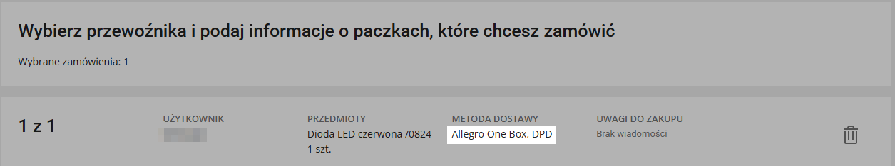

Przy nadawaniu do pól wstawiane są wartości domyśłne (lub zaznaczana jest domyślna opcja). Aby wstawić inne wartości, kliknij nazwę szablonu. Aby ustawić dany szablon jako domyślny, możesz kliknąć i przytrzymać daną nazwę szablonu (lub wybieralną opcję) aż podświetli się na zielono. Możesz też zmienić to w ustawieniach zaznaczając odpowieni szablon (opcję) i klikając "Zapisz".

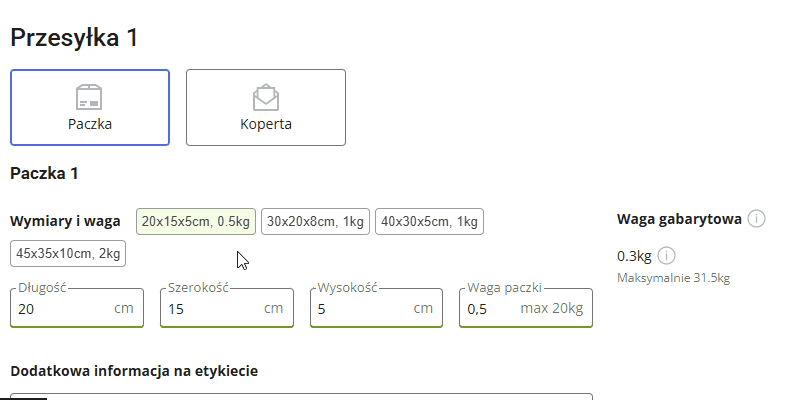
   
   
### Szybkie przełączanie sposobu nadawania przesyłek InPost

Zaznacza automatycznie wybrany sposób nadania przesyłki InPost: 
- Nadam przesyłkę z podjazdem kuriera InPost  
- Nadam przesyłkę w Paczkomacie InPost  
- Nadam przesyłkę w PaczkoPunkcie InPost

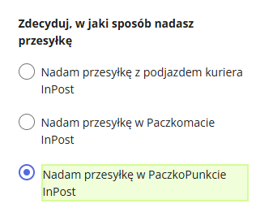

Zmiany domyślnej opcji możesz dokonać w ustawieniach rozszerzenia lub klikając i przytrzymując wybraną opcję na stronie "Wysyłam z Allegro" aż podświetli się na zielono.

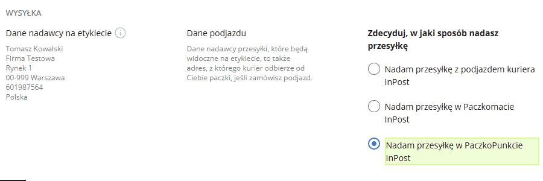
   
   
### Wykrywanie błędów w danych adresowych
Allegro zezwala kupującym na wprowadzanie danych, które przy próbie zapisania przesyłki spowodują wystąpienie błędu. Należą do nich m.in.
- brak spacji między nazwą ulicy a numerem domu
- zbyt krótkie lub zbyt długie imię lub nazwisko
- zbyt długa nazwa firmy, ulicy, miejscowości
- numer telefonu w niewłaściwym formacie lub spoza polskiej sieci

Moduł ten wykrywa wystąpienie błędnych danych i automatycznie otwiera okno ich edycji ze wskazaniem co należy zmienić aby uniknąć błędu podczas zapisywania przesyłki. Niestety kombinacji jest bardzo dużo - każdy przewoźnik ma swoje ograniczenia, ponadto czasami ulegają one zmianie. Jakiś czas temu sporo z tych ograniczeń zostało usuniętych, tak więc restrykcje zostały całkiem nieźle poluzowane, dalej jednak występują.

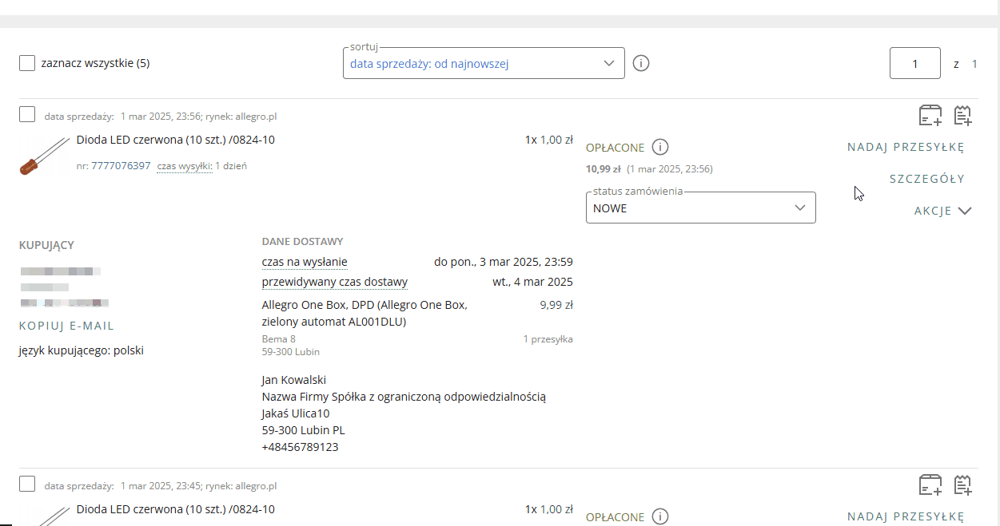

Moduł posiada opcję która przyda mi się przy usprawnianiu działania tego narzędzia - anonimowe wysyłanie zanonimizowanych danych w momencie wystąpienia błędu. Działa to na zasadzie przesyłania informacji o metodzie dostawy oraz próbki danych w których dane klienta zostały zastąpione jedynie informacją z ilu znaków i jakiego rodzaju (litery, cyfry, polskie znaki lub pozostałe znaki) się one składają, np.

| Imię i nazwisko | JanKowalski      | Imię i nazwisko | LLLLLLLLLLL      |
|-----------------|------------------|-----------------|------------------|
| Nazwa firmy     | -                | Nazwa firmy     | -                |
| Ulica i numer   | Błędna1/2        | Ulica i numer   | LLALLLN/N        |
| Kod pocztowy    | 59-300           | Kod pocztowy    | NN-NNN           |
| Miejscowość     | Lubin k. Legnicy | Miejscowość     | LLLLL L. LLLLLLL |
| Kraj            | Polska           | Kraj            | PL               |
| Telefon         | +48601234567     | Telefon         | +NNNNNNNNNN      |

Próbka taka w momencie wystąpienia błędu podczas zapisywania przesyłki zostanie wysłana do mojej bazy danych, dzięki czemu będę mógł znaleźć odpowiednie wzorce powodujące wystąpienie błędów i usprawnić działanie rozszerzenia. Jeśli chcesz mnie w tym wesprzec - zaznacz opcję "Pomóż ulepszyć program anonimowo przesyłając zanonimizowane dane w momencie wystąpienia błędu."

Ten moduł korzysta z API. Wymagane uprawnienia: ``allegro:api:orders:read``
   
   
### Zmiana tytułu aukcji na liście ofert

Pozwala zmienić tytuł aukcji bezpośrednio na liście ofert bez konieczności przechodzenia przez formularz edycji. Przydatne zwłaszcza gdy chcesz zmienić wiele tytułów aukcji w krótkim czasie lub znajdziesz błąd w tytule i chcesz szybko go poprawić. Oprócz tego poszerza trochę kolumnę z tytułem aukcji aby nie skracało tekstu gdy tytuł ten jest bardzo długi, zbliżony do maksymalnego limitu znaków.

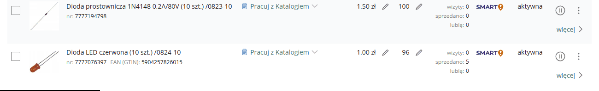

W celu zmiany tytułu, najedź na niego, wciśnij zdefiniowany skrót klawiaturowy (domyślnie <kbd>Ctrl</kbd> + <kbd>Ins</kbd>), po edycji zatwierdź przyciskiem lub klawiszem <kbd>Enter</kbd>. Aby anulować możesz kliknąć przycisk anulowania, kliknąć gdziekolwiek poza polem edycji lub wcisnąć klawisz <kbd>Esc</kbd>. Moduł sprawdza na bieżąco czy tytuł jest poprawny (długość tekstu nie przekracza 75 znaków, nie zawiera znaków typu emoji lub dwóch spacji pod rząd).

Ten moduł korzysta z API. Wymagane uprawnienia: ``allegro:api:sale:offers:read, allegro:api:sale:offers:write``
   
   
### Szybka zmiana liczby przedmiotów

Pozwala zmienić liczbę przedmiotów na aukcji bez konieczności przechodzenia przez formularz edycji oraz jeszcze szybciej niż przy pomocy edycji za pomocą ołówka obok liczby sztuk. Wystarczy najechać na liczbę sztuk i po podświetleniu jej na żółto można dokonać edycji przyciskami lub kółkiem myszki albo kliknąć i wpisać z klawiatury lub zmienić strzałkami na klawiaturze i zatwierdzić przyciskiem lub klawiszem <kbd>Enter</kbd> Aby anulować wystarczy odsunąć myszkę poza obszar wpisywania i przycisków lub w trakcie wpisywania wcisnąć klawisz <kbd>Esc</kbd>.

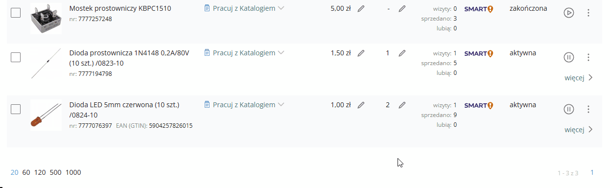

Po prawidłowej zmianie otrzymasz komunikat "Zmieniono" oraz pole zmieni kolor na zielony. Zalecane jest wtedy odświeżenie strony, a to dlatego że jeżeli zmieni się status aukcji (zmniejszysz liczbę do 0, czyli zakończysz aukcję albo zwiększysz ze stanu zerowego, czyli wznowisz aukcję), to stan w kolumnie "status" dalej pozostanie niezmieniony, mimo dokonanej zmiany. Ponadto jeżeli przewiniesz stronę tak że to pole schowa się poza widoczną zawartość strony a następnie przewiniesz z powrotem, to wyświetlona zostanie stara wartość, już bez zielonego koloru.

Ustawienie stanu na 0 zakończy aukcję, zwiększenie stanu w zakończonej aukcji zaś wznowi ją z ustawionym stanem.

Ten moduł korzysta z API. Wymagane uprawnienia: ``allegro:api:sale:offers:read, allegro:api:sale:offers:write``
   
   
### Przywracanie przedmiotów z anulowanego zamówienia
Moduł ten pozwala w łatwy sposób przywrócić stan przedmiotów na aukcjach po anulowaniu zamówienia przez kupującego (lub po automatycznym anulowaniu albo po zwrocie). Jeżeli w sekcji danego zamówienia pojawi się któryś ze zwrotów: "Kupujący anulował", "Kupujący zgłosił zwrot", "Automatyczne anulowanie - informacja", "rabat transakcyjny" to pojawi się dodatkowy przycisk "Przywróć stan".

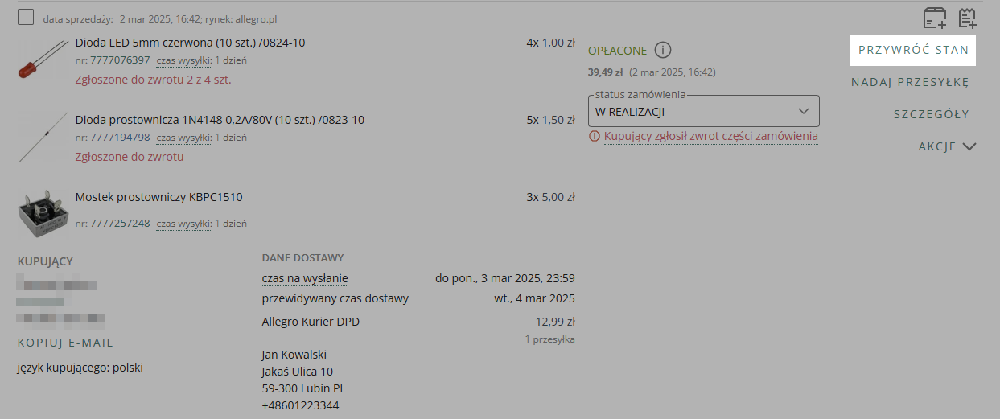

Po jego kliknięciu pojawi się okno z przedmiotami które zostały anulowane (zwrócone) wraz z uwzględnieniem liczby sztuk. Możesz odznaczyć przedmioty których nie chcesz przywracać lub zmienić liczbę sztuk o którą ma zmienić się stan magazynowy na aukcji.

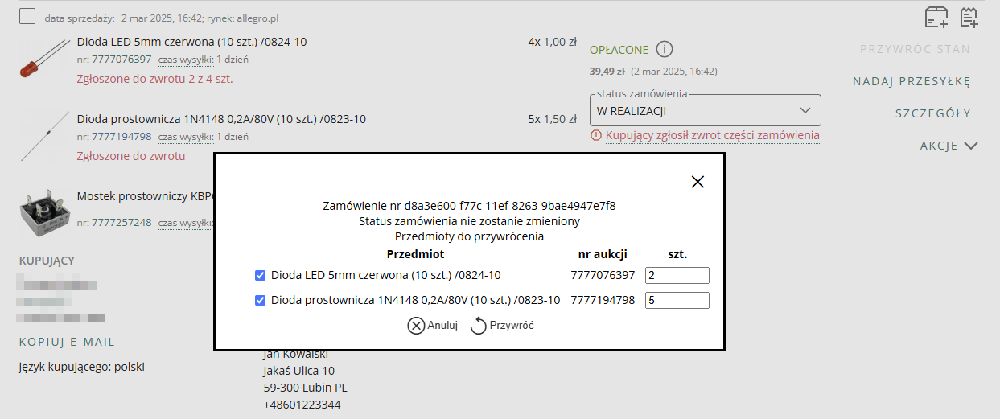

Po kliknięciu przycisku "Przywróć" stan magazynowy przedmiotów na aukcjach zostanie przywrócony. Jeśli zamówienie było anulowane w całości - jego status zostanie ustawiony na "Anulowane". Jeśli zwrot był częściowy, status zamówienia nie zostanie zmieniony. Jeśli aukcja została zakończona z zerowym stanem magazynowym (wyprzedano wszystkie przedmioty), zostanie ona wznowiona. Jeśli aukcja została zakończona wcześniej z niezerowym stanem magazynowym, aukcja nie zostanie wznowiona i pojawi się komunikat informujący o tym że taką aukję trzeba wznowić ręcznie.

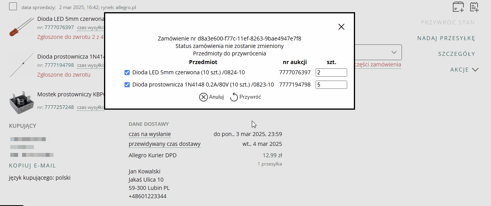

Ten moduł korzysta z API. Wymagane uprawnienia: ``allegro:api:sale:offers:read, allegro:api:sale:offers:write, allegro:api:orders:read, allegro:api:orders:write``
   
   
### Przywracanie przedmiotów z listy zwrotów

Moduł ten pozwala w łatwy sposób przywrócić stan przedmiotów na aukcjach po dokonaniu zwrotu przez kupującego. Jeżeli na stronie listy zwrotów znajdzie się zwrot z ostatnich 60 dni ze statusem "Doręczony" lub "W drodze", w sekcji danego zwrotu pojawi się dodatkowy przycisk "Przywróć stan" (na zdjęciu widoczne jest że pojawia się również dla statusu "Zwrot zgłoszony", jednak jest to tylko tymczasowo na potrzeby przygotowania niniejszej dokumentacji, taki status nie powinien być brany pod uwagę aby nie dokonać zwrotu przedwcześnie).

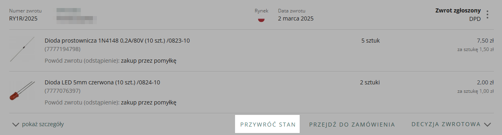

Po jego kliknięciu pojawi się okno z przedmiotami które zostały zwrócone wraz z uwzględnieniem liczby sztuk. Możesz odznaczyć przedmioty których nie chcesz przywracać lub zmienić liczbę sztuk o którą ma zmienić się stan magazynowy na aukcji.

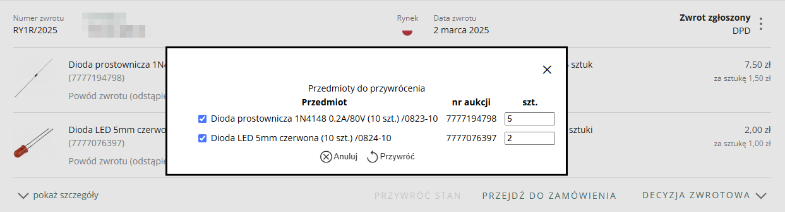

Po kliknięciu przycisku "Przywróć" stan magazynowy przedmiotów na aukcjach zostanie przywrócony. Jeśli aukcja została zakończona z zerowym stanem magazynowym (wyprzedano wszystkie przedmioty), zostanie ona wznowiona. Jeśli aukcja została zakończona wcześniej z niezerowym stanem magazynowym, aukcja nie zostanie wznowiona i pojawi się komunikat informujący o tym że taką aukję trzeba wznowić ręcznie.

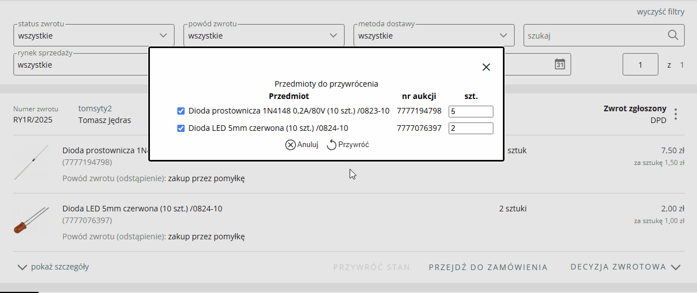

Po kliknięciu przycisku "Decyzja zwrotowa" na liście przedmiotów do zwrotu zostaną zaznaczone te, które klient zaznaczył w formularzu zwrotu, z uwzględnieniem ich liczby sztuk. Na poniższym gifie przedstawione zostanie inne zamówienie niż powyżej - większość dokumentacji szykuję na serwisie testowym, jednak pewnych czynności nie można na nim wykonać, tak więc zostanie przedstawione zamówienie z normalnego serwisu Allegro.

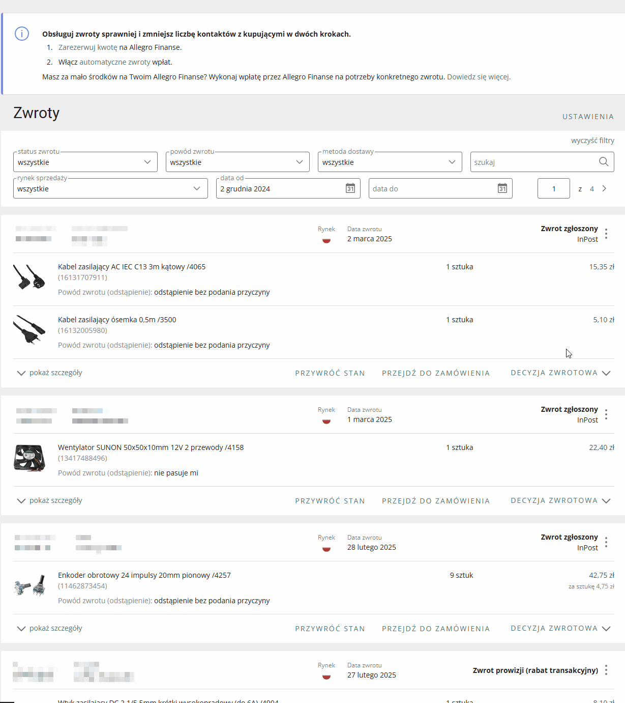

Po zaznaczeniu przedmiotów wskaż decyzję zwrotową i dokonaj zwrotu.

Jeśli korzystasz z serwisu iFirma, jest dodatkowy plus ze stosowania tego modułu. Dla zamówień zwróconych należy wypełnić w tym serwisie protokół zwrotu. Aby zautomatyzować ten proces, możesz zaznaczyć na stronie opcji rozszerzenia opcję "Uzupełniaj pola "Pozycje" na stronie protokołu anulowania sprzedaży w serwisie iFirma". Dzięki temu lista przedmiotów do zwrotu wraz z liczbą sztuk i ceną pojawi się na stronie protokołu anulowania sprzedaży. W tym celu najpierw otwórz stronę iFirma i przejdź do protokołu anulowania sprzedaży, następnie kliknij na liście zwrotów w Allegro dodatkowy przycisk "Protokół anulowania"

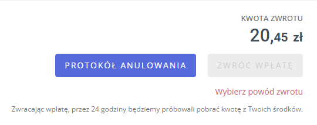

Po jego kliknięciu lista zaznaczonych przedmiotów wraz liczbą sztuk i ceną za szt. zostanie skopiowana na stronę protokołu anulowania sprzedaży

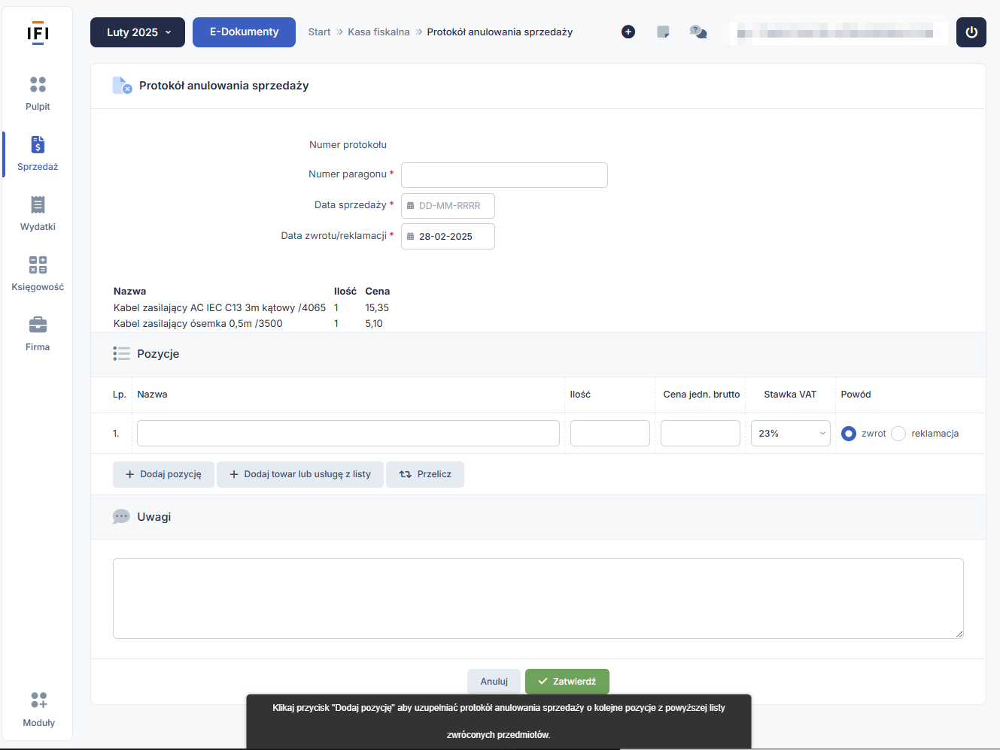

Niestety obecnie nie ma możliwości automatycznego wypełnienia tego formularza, ale jest pewne ułatwienie w jego wypełnianiu. Po przeniesieniu listy przedmiotów na stronę formularza wystarczy po kolei klikać przycisk "Dodaj pozycję". Poszczególne pozycje zostaną zdjęte z listy i podstawione do odpowiednich pól formularza.

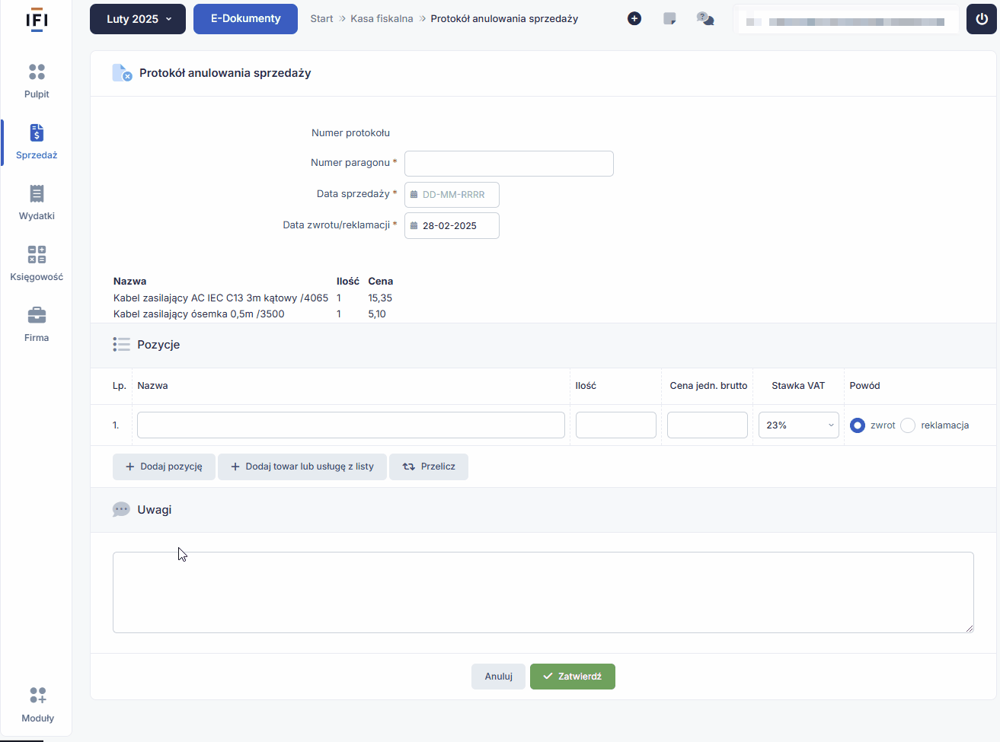

Pracuję jeszcze nad stabilnością tego rozwiązania, ponieważ czasami zdarzy się że po kliknięciu "Dodaj pozycję" pola nie zostaną wypełnione. Trzeba wtedy ponownie otworzyć stronę protokołu anulowania sprzedaży, cofnąć się na liście zwrotów Allegro, kliknąć ponownie przycisk "Decyzja zwrotowa" i przycisk "Protokół zwrotu". Dlatego najlepiej nie klikać przycisku "Zwróć wpłatę", póki nie wypełnisz protokołu anulowania sprzedaży - w przeciwnym wypadku przy ponownym kliknięciu przycisku "Decyzja zwrotowa" zaznaczone do zwrotu przedmioty będą już nieaktywne gdyż zwrot za nie został wykonany tak więc nie będzie można przenieść tych pozycji do protokołu anulowania sprzedaży i trzeba będzie wypełniać go ręcznie.

Ten moduł korzysta z API. Wymagane uprawnienia: ``allegro:api:sale:offers:read, allegro:api:sale:offers:write, allegro:api:orders:read``
   
   
### Pokazuj nazwę produktu na liście ofert

Moduł ten pokazuje nazwę produktu na liście ofert w kolumnie "Katalog produktów Allegro". Dodatkowo pokazuje średnią ocenę produktu wraz z reprezentacją graficzną rozkładu liczby gwiazdek.

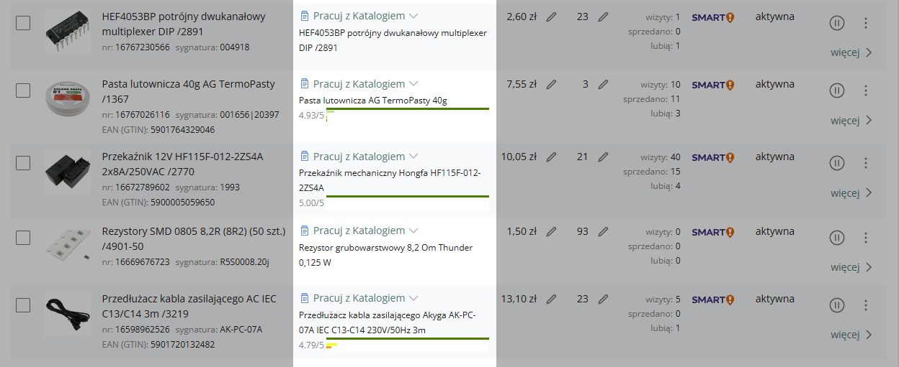

Po najechaniu myszką na wykres graficzny rozkład ten zostanie przedstawiony bardziej szczegółowo.

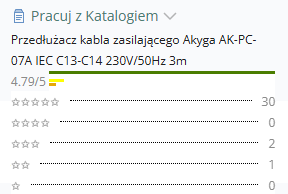

Ten moduł korzysta z API. Wymagane uprawnienia: ``allegro:api:sale:offers:read``
   
   
### Pokazuj stan magazynowy i nazwę produktu na liście zamówień

Ten moduł pokazuje stan magazynowy aukcji i nazwę produktu na liście zamówień. Można dzięki temu w łatwy sposób kontrolować stan magazynowy w trakcie pakowania - np. gdy zobaczymy że po spakowaniu przedmiotu którego ostatnią sztukę wyjęliśmy z pudełka pokazuje nam że jest jeszcze kilka sztuk na aukcji, możemy szybko ją zakończyć. Alternatywnie gdy widzimy że została np. jedna sztuka a my mamy ich więcej, możemy szybko zwiększyć ich stan na aukcji. Moduł uwzględnia liczbę sprzedanych sztuk w pozostałych zamówieniach mających status płatności "Opłacone" lub "Płatność za pobraniem", nie bierze pod uwagę zamówień nieopłaconych.

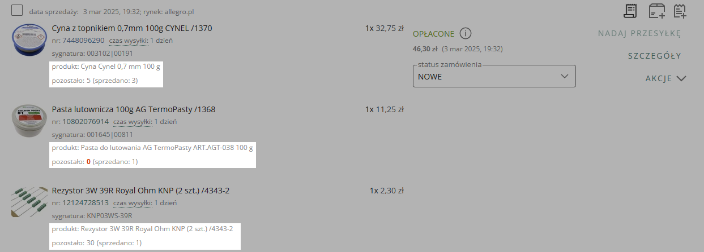

Stan magazynowy możesz zmienić klikając liczbę przy napisie "pozostało:" następnie zwiększyć lub zmniejszyć strzałkami na klawiaturze w górę / w dół i zatwierdzić klawiszem <kbd>Enter</kbd> lub anulować klikając w dowolne miejsce poza tą liczbą lub klawiszem <kbd>Esc</kbd>. Zmniejszenie stanu do 0 spowoduje zakończenie aukcji, zwiększenie stanu z zerowego do większego od zera wznowi aukcję. Wznawianie trwa trochę dłużej niż normalna zmiana.

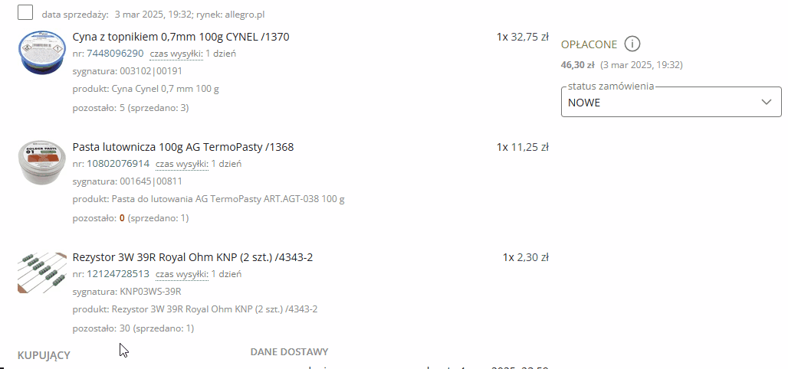

Ten moduł korzysta z API. Wymagane uprawnienia: ``allegro:api:sale:offers:read, allegro:api:sale:offers:write, allegro:api:orders:read``
   
   
### Zmień grupowo dodatkowe informacje od sprzedającego

Ten moduł pozwala na grupową zmianę pola "Dodatkowe informacje od sprzedającego" we wszystkich aukcjach. Włącz ten moduł za każdym razem gdy chcesz go użyć, jego stan nie będzie zapisywany. Ponieważ moduł ten nie jest uruchamiany w kontekście strony musisz wskazać czy chcesz dokonać zmiany w normalnym serwisie Allegro czy w serwisie testowym Sandbox.

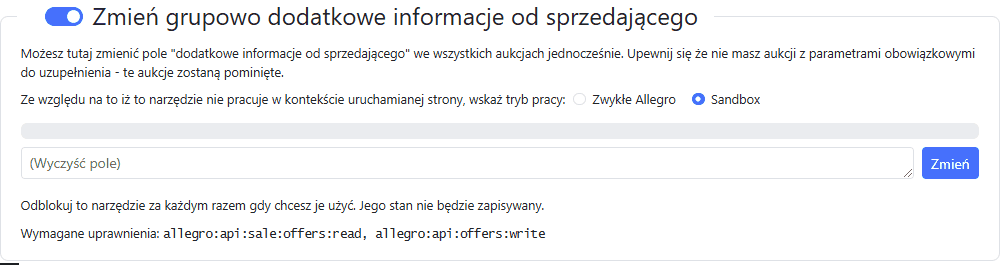

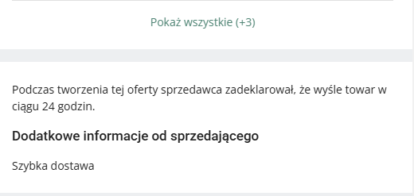

Ten moduł korzysta z API. Wymagane uprawnienia: ``allegro:api:sale:offers:read, allegro:api:offers:write``

***
## Rozwiązywanie problemów

> [!IMPORTANT]
> Jeśli włączysz albo wyłączysz jakiś moduł na stronie opcji rozszerzenia, musisz odświeżyć wszystkie otwarte strony Sales Center.

Najczęstszym problemem z działaniem rozszerzenia jest to, że nie zawsze załaduje się ono na stronie za pierwszym razem. Czasami po uruchomieniu przeglądarki i wejściu na stronę Sales Center rozszerzenie może nie wykonywać swojej pracy, np. jeśli masz włączony moduł "Pokazuj stan magazynowy i nazwę produktu na liście zamówień" - nic takiego się nie pokaże. Spróbuj odświeżyć stronę (<kbd>Ctrl</kbd> + <kbd>F5</kbd>), jeśli dalej nic się nie dzieje - sprawdź konsolę dewelopera (wciśnij klawisz <kbd>F12</kbd>) i odśwież stronę. Sprawdź czy pojawią się wpisy "załadowano skrypt (...)".

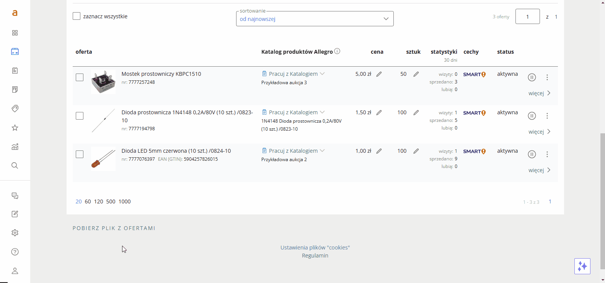

Czasami rozszerzenie może wymagać przeładowania na stronie rozszerzeń. Po przeładowaniu musisz odświeżyć wszystkie otwarte strony Sales Center. Na tej stronie w kafelku rozszerzenia może też pojawić się przycisk "Błędy", gdzie wymienione będą problemy, są to raczej informacje dla programistów a nie użytkowników, ale dla mnie mogą być przydatne w celu znalezienia źródła problemu.

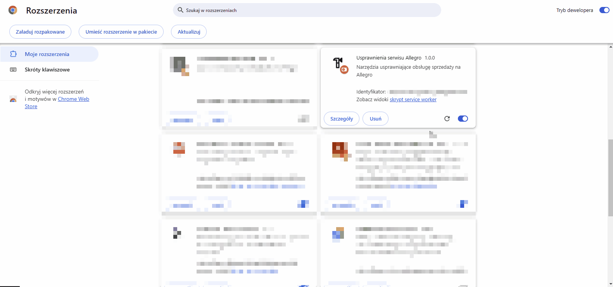

W przypadku modułów korzystających z API błędem może być nie zaznaczenie właściwych uprawnień na stronie [apps.developer.allegro.pl](https://apps.developer.allegro.pl/). Moduły korzystają z minimalnej potrzebnej liczby uprawnień, pamiętaj że jeśli włączysz jakiś moduł i na stronie opcji rozszerzeń dokonasz logowania a następnie włączysz inny moduł korzystający z innych uprawnień, musisz ponownie kliknąć "Zaloguj".

***
Jeżeli napotkasz jakieś błędy w trakcie działania aplikacji, masz jakieś pytania, sugestie, problemy z obsługą, daj znać w sekcji "Discussions".
Jeżeli podoba Ci się moja praca i chcesz aby była dalej rozwijana, możesz wesprzeć mnie dotacją na dowolną kwotę przez PayPal (nie ma potrzeby posiadania konta PayPal): [przekaż donację](https://www.paypal.com/donate/?hosted_button_id=GVU3UC2ZY85SN&locale.x=pl_PL)
