## Allegro Extensions
To rozszerzenie usprawnia pracę z Allegro dodając brakujące funkcjonalności i automatyzując niektóre czynności. Składa się z wielu modułów, które mogą być włączane w zależności od potrzeb.

Jest to rozszerzenie do przeglądarki Chrome. Wszystkie rozszerzenia testuję tylko dla systemu Windows 10 i najnowszej wersji przeglądarki.

**Na wstępie pragnę zaznaczyć że nie odpowiadam za żadne problemy wynikłe z użytkowania tego rozszerzenia. Z wielu funkcjonalności po prostu nie korzystam - np. z zestawów produktów, wznawiania ofert z pełnym zestawem przedmiotów itp. tak więc nie wiem jak zachowa się ono w określonych sytuacjach.**

Jeśli pracujesz na wielu komputerach, miej na uwadze że rozszerzenie nie synchronizuje swojego działania między nimi, wszelkie dane są zapisywane lokalnie na danym komputerze.

**Instrukcja instalacji:**
1. Pobierz rozszerzenie "allegro_extensions.zip" z listy plików widocznej powyżej i rozpakuj je tam gdzie zamierzasz je trzymać.
2. Kliknij ikonę menu rozszerzeń w prawym górnym rogu okna przeglądarki (ikona puzzla)  lub z menu przeglądarki wybierz "Rozszerzenia - Zarządzaj rozszerzeniami".
3. Włącz "Tryb dewelopera" w prawym górnym rogu okna przeglądarki 
4. Kliknij przycisk "Załaduj rozpakowane"  
	
	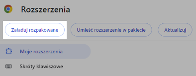
5. Wybierz folder z uprzednio pobranym i rozpakowanym rozszerzeniem.
6. Po załadowaniu rozszerzenia otworzy się strona jego opcji, gdzie będziesz mógł włączyć poszczególne moduły. Część z nich nie wymaga dostępu do API, są to moduły: 
	- Zmiana koloru ikony FV
	- Automatyczne pobieranie i drukowanie etykiet adresowych
	- Wypełnianie wagi i wielkości przesyłki
	- Szybkie przełączanie sposobu nadawania przesyłek InPost
	- Szybkie wysyłanie nowej wiadomości do kupującego
	- Dodatkowe opcje sortowania zamówień

	Pozostałe moduły korzystają z API, aby ich używać wymagane będzie uzupełnienie danych Client ID i Client Secret. Uzyskasz je rejestrując aplikację na stronie [apps.developer.allegro.pl](https://apps.developer.allegro.pl/)
	

	
Instrukcja rejestracji aplikacji

	
	1. Otwórz stronę [developer.allegro.pl](https://developer.allegro.pl/).
	2. Kliknij "Zarządzaj API" - "Moje aplikacje". Upewnij się że zalogowany jesteś na konto Allegro w ramach którego działać będzie aplikacja. Jeśli nie, wyloguj się (klikając ikonę obok nazwy użytkownika i wybierz "Wyloguj") a następnie zaloguj się na właściwe konto.
	3. Kliknij przycisk "Zarejestruj aplikację".  
	4. W formularzu rejestracji aplikacji Allegro podaj następujące dane:
		- **Nazwa aplikacji:** dowolna, np. "Allegro Extensions"
		- **Wybierz rodzaj aplikacji:** zaznacz pierwszą opcję - "Aplikacja ma dostęp do przeglądarki, w której użytkownik loguje się do Allegro (np. aplikacja na serwerze albo plik wykonywalny)"  

			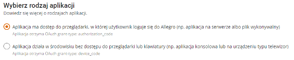
		- **Ścieżka aplikacji:** na stronie opcji rozszerzenia zaznacz i skopiuj tekst widniejący przy parametrze **Ścieżka aplikacji**. Jest to unikalny adres aplikacji w domenie chromiumapp.org pod który Allegro będzie przesyłać kod autoryzujący i tokeny dostępowe.
		- **Uprawnienia aplikacji:** przy każdym module korzystającym z API podane są wymagane uprawnienia. Zaznacz te z których będziesz korzystać oraz `allegro:api:profile:read` (sekcja **Dane osobowe**). Jeśli już po zalogowaniu włączysz moduł korzystający z dodatkowych uprawnień, nie zaznaczonych wcześniej, będzie wymagana edycja zarejestrowanej aplikacji na stronie [apps.developer.allegro.pl](https://apps.developer.allegro.pl/) i zaznaczenie tych uprawnień oraz ponowne kliknięcie przycisku "Zaloguj" na stronie opcji rozszerzenia.  

			Na stronie opcji rozszerzenia przyznane już uprawnienia oznaczone są zielonym kolorem. Jeżeli jakieś uprawnienia nie zostały przyznane, oznaczone będą one czerwonym kolorem.  

			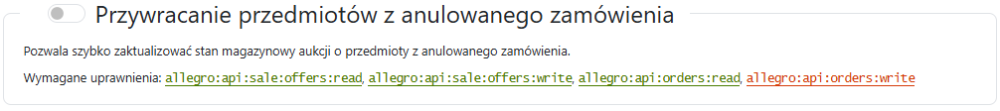
			Uprawnienia dotyczące zwykłego serwisu Allegro określa kolorowa czcionka. Podkreślenie oznacza uprawnienia dla serwisu testowego Sandbox. Jeśli nie korzystasz z niego, wszystkie uprawnienia będą miały czerwone podkreślenie.
			
			Jeżeli w momencie włączania modułu nie masz przyznanych uprawnień - pojawi się powiadomienie

			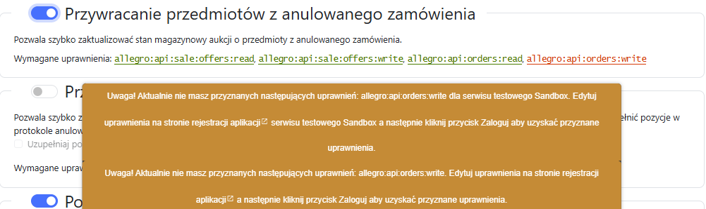

			Musisz wtedy edytować zarejestrowaną aplikację na stronie [apps.developer.allegro.pl](https://apps.developer.allegro.pl/) i zaznaczyć wymagane uprawnienia. Po dokonaniu tej czynności trzeba ponownie kliknąć przycisk Zaloguj na stronie opcji rozszerzenia.

		- Zaznacz `* Znam i akceptuję regulamin REST API Allegro`.
		- Kliknij przycisk "Zarejestruj".
		- Na koncie możesz mieć do 5 zarejestrowanych aplikacji. Jeżeli chciałbyś ją usunąć zrobisz to na tej samej stronie.
	5. Aplikacja zostanie zarejestrowana. Kliknij "Szczegóły" aby odczytać Client ID i Client Secret. Zaznacz i skopiuj parametr Client ID, wklej go na stronie opcji rozszerzenia w polu Client ID. Kliknij "Pokaż" przy parametrze Client Secret, aby odsłonić domyślnie zamaskowaną wartość tego parametru, zaznacz i skopiuj parametr Client Secret, wklej go na stronie opcji rozszerzenia w polu Client Secret. Zamknij okno ze szczegółami aplikacji.
	6. Kliknij "Zapisz" a następnie "Zaloguj" na stronie opcji rozszerzenia. Zostaniesz przeniesiony na stronę Allegro gdzie musisz potwierdzić że kontynuujesz jako zalogowany użytkownik  
		
		
	7. Kliknij przycisk "Kontynuuj".
	8. Zostaniesz przeniesiony na stronę Allegro z pytaniem czy chcesz powiązać swoje konto z aplikacją  
	
		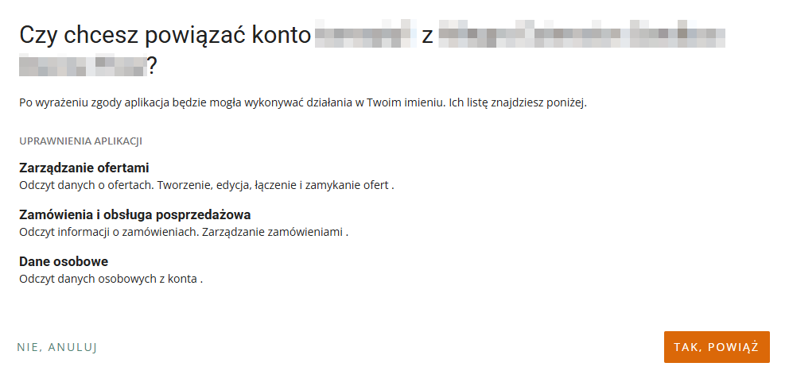
	9. Kliknij przycisk "Tak, powiąż konto". Jeśli chiałbyś usunąć powiązanie aplikacji z kontem zrobisz to na stronie Allegro - Moje Allegro - Konto - Bezpieczeństwo - [Powiązane aplikacje](https://allegro.pl/moje-allegro/moje-konto/powiazane-aplikacje)
	10. Na stronie opcji rozszerzenia pojawi się komunikat o zalogowaniu wraz z nazwą użytkownika.  
	

7. Jeżeli miałeś otwartą stronę Sales Center, odśwież ją, celem załadowania rozszerzenia. Sporadycznie może zdarzyć się, że rozszerzenie nie załaduje się przy wejściu na stronę Sales Center, najlepiej wtedy odświeżyć stronę (<kbd>Ctrl</kbd> + <kbd>F5</kbd>), ewentualnie załadować ponownie rozsrzerzenie  
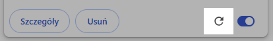  
po czym koniecznie musisz odświeżyć wszystkie otwarte karty Sales Center (lub zamknąć je i otworzyć od nowa).

Rozszerzenie możesz sprawdzić w serwisie testowym [Allegro Sandbox](https://developer.allegro.pl/tutorials/informacje-podstawowe-b21569boAI1#srodowisko-testowe).  

Instrukcja rejestracji aplikacji dla serwisu testowego

Uzyskanie danych dostępowych dla serwisu testowego jest trochę bardziej skomplikowane niż dla normalnego Allegro. Powodem jest to że rozszerzenie nie może uzyskać tokenów dostępowych w taki sam sposób, choć jakiś czas temu było to jeszcze możliwe więc zmiana zaszła albo po stronie Allegro albo przy którejś wersji Chrome. Kontaktowałem się z obsługą na stronie GitHub Allegro jednak oni nie widzą problemu, poza tym nie wspierają konkretnych języków programowania a ponieważ raczej nikt nie pisze rozszerzeń do przeglądarki Chrome działających z Allegro tylko tworzy się serwisy lub zewnętrzne aplikacje działające w inny sposób i tam ten problem nie występuje to nie będą drążyć tematu.

Trzeba było więc sobie jakoś z tym poradzić więc stworzyłem zewnętrzną aplikację pośredniczącą w uzyskiwaniu tokenów dostępowych do serwisu Allegro Sandbox. Zdaję sobie sprawę że nie każdy posiada serwer z obsługą Node.js dlatego działa ona jako aplikacja w ramach konta Google które większość osób i tak posiada albo może bez problemu założyć.

1. Przejdź na stronę [script.google.com](https://script.google.com/).
2. Kliknij "Ustawienia" - "Google Apps Script API" - włącz.
3. Kliknij "Nowy projekt". Otworzy się edytor domyślnego pliku "Kog.gs". Zmień nazwę projektu z "Projekt bez nazwy" na np. "Allegro".
4. Otwórz plik "Kod.js" z listy plików na górze tej strony i skopiuj jego zawartość.
5. Usuń z edytora obecną zawartość pliku i wklej skopiowany tekst. Zapisz wciskając <kbd>Ctrl</kbd> + <kbd>s</kbd>.
6. Kliknij "Wdróż" - "Nowe wdrożenie".
7. Kliknij ikonę kółka zębatego i wybierz "Aplikacja internetowa". Pole "Opis" nie jest wymagane, parametr "Wykonaj jako": "Ja (adres konta Google)", "Kto ma dostęp" zmień na "Każdy". Kliknij "Wdróż"  

	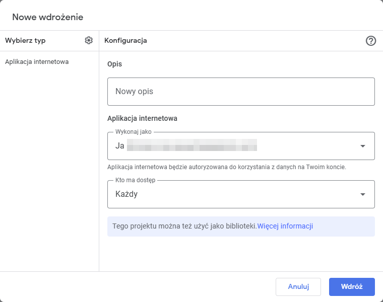
8. Pojawi się komunikat o konieczności udzielenia dostępu do aplikacji internetowej. Kliknij przycisk "Udziel dostępu", wybierz konto Google, pojawi się kolejny komunikat informujący o tym że aplikacja nie jest zweryfikowana. Kliknij "Zaawansowane", następnie "Otwórz Allegro (niebezpieczne)" (gdzie "Allegro" to nazwa aplikacji nadana wcześniej w edytorze)  

	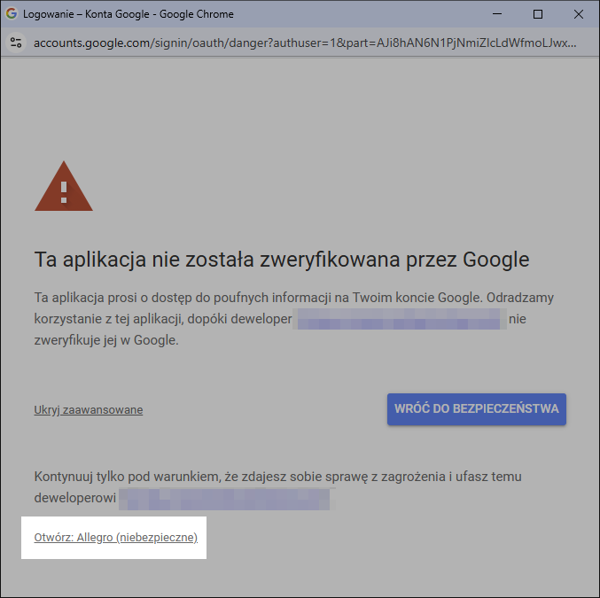
9. W kolejnym komunikacie pojawi się informacja że aplikacja chce uzyskać dostęp do konta Google w zakresie łączenia się z usługą zewnętrzną. Kliknij "Zezwól"  

	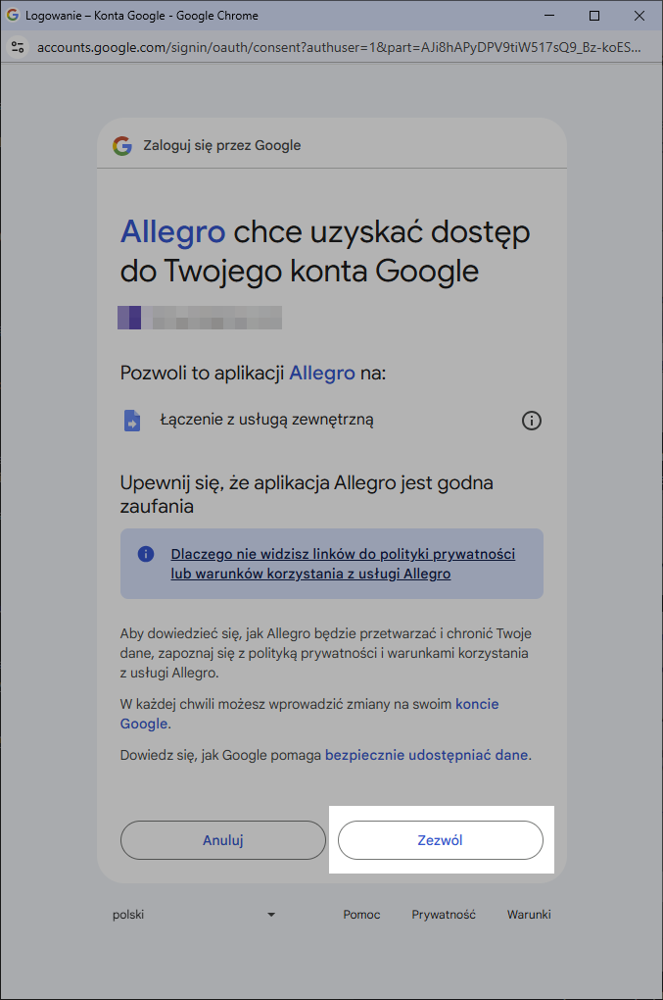

	Jeśli chciałbyś usunąć udzielony dostęp do konta Google zrobisz to w ustawieniach konta, sekcja "Bezpieczeństwo" - "Twoje połączenia z aplikacjami i usługami innych firm".
10. Na stronie wdrożenia pojawi się komunikat ze szczegółami wdrożenia, z których istotnym parametrem jest link - aplikacja internetowa. Skopiuj go i wklej na stronie opcji rozszerzenia do pola "Adres aplikacji internetowej"  

	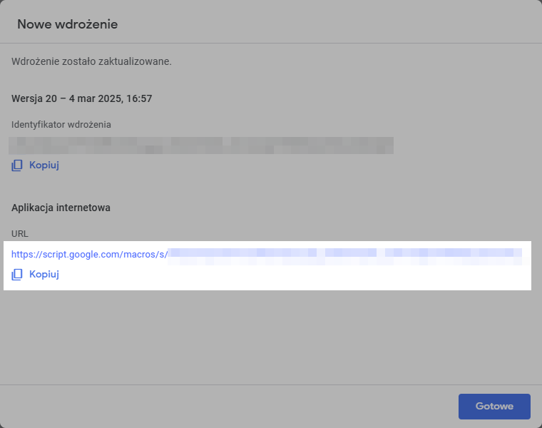  
11. Przejdź na stronę [developer.allegro.pl](https://developer.allegro.pl/).
12. Kliknij "Zarządzaj API" - "Moje aplikacje (sandbox)". Upewnij się że zalogowany jesteś na konto Allegro (sandbox) w ramach którego działać będzie aplikacja. Jeśli nie, wyloguj się (klikając ikonę obok nazwy użytkownika i wybierz "Wyloguj") a następnie zaloguj się na właściwe konto.
13. Kliknij przycisk "Zarejestruj aplikację".
14. W formularzu rejestracji aplikacji Allegro podaj następujące dane:
	- **Nazwa aplikacji:** dowolna, np. "Allegro Extensions"
	- **Wybierz rodzaj aplikacji:** zaznacz drugą opcję ("Aplikacja działa w środowisku bez dostępu do przeglądarki lub klawiatury (np. aplikacja konsolowa lub na urządzeniu typu telewizor)")  

		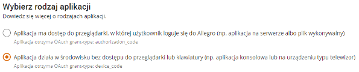
	- **Uprawnienia aplikacji:** przy każdym module korzystającym z API podane są wymagane uprawnienia. Zaznacz te z których będziesz korzystać oraz `allegro:api:profile:read` (sekcja **Dane osobowe**). Jeśli już po zalogowaniu włączysz moduł korzystający z dodatkowych uprawnień, nie zaznaczonych wcześniej, będzie wymagana edycja zarejestrowanej aplikacji na stronie [apps.developer.allegro.pl.allegrosandbox.pl](https://apps.developer.allegro.pl.allegrosandbox.pl/) i zaznaczenie tych uprawnień oraz ponowne kliknięcie przycisku "Zaloguj" na stronie opcji rozszerzenia.  

		Na stronie opcji rozszerzenia przyznane już uprawnienia oznaczone są zielonym kolorem. Jeżeli jakieś uprawnienia nie zostały przyznane, oznaczone będą one czerwonym kolorem.  

		
		Uprawnienia dotyczące zwykłego serwisu Allegro określa kolorowa czcionka. Podkreślenie oznacza uprawnienia dla serwisu testowego Sandbox.
		
		Jeżeli w momencie włączania modułu nie masz przyznanych uprawnień - pojawi się powiadomienie

		

		Musisz wtedy edytować zarejestrowaną aplikację na stronie [apps.developer.allegro.pl.allegrosandbox.pl](https://apps.developer.allegro.pl.allegrosandbox.pl/) i zaznaczyć wymagane uprawnienia. Po dokonaniu tej czynności trzeba ponownie kliknąć przycisk Zaloguj na stronie opcji rozszerzenia.

	- Zaznacz `* Znam i akceptuję regulamin REST API Allegro`.
	- Kliknij przycisk "Zarejestruj".
	- Na koncie możesz mieć do 5 zarejestrowanych aplikacji. Jeżeli chciałbyś ją usunąć zrobisz to na tej samej stronie.
15. Aplikacja zostanie zarejestrowana. Kliknij "Szczegóły" aby odczytać Client ID i Client Secret. Zaznacz i skopiuj parametr Client ID, wklej go na stronie opcji rozszerzenia w polu Client ID. Kliknij "Pokaż" przy parametrze Client Secret, aby odsłonić domyślnie zamaskowaną wartość tego parametru, zaznacz i skopiuj parametr Client Secret, wklej go na stronie opcji rozszerzenia w polu Client Secret. Zamknij okno ze szczegółami aplikacji.
16. Kliknij "Zapisz" a następnie "Zaloguj" na stronie opcji rozszerzenia. Zostaniesz przeniesiony na stronę Allegro gdzie musisz wprowadzić kod podany przez aplikację (kod uzupełni się automatycznie)  

	
17. Kliknij przycisk "Dalej". Zostaniesz przeniesiony na stronę Allegro gdzie musisz potwierdzić że kontynuujesz jako zalogowany użytkownik  

	
18. Kliknij przycisk "Kontynuuj". Zostaniesz przeniesiony na stronę Allegro z pytaniem czy chcesz powiązać swoje konto z aplikacją  

	
19. Kliknij przycisk "Tak, powiąż konto". Jeśli chiałbyś usunąć powiązanie aplikacji z kontem zrobisz to na stronie Allegro - Moje Allegro - Konto - Bezpieczeństwo - [Powiązane aplikacje](https://allegro.pl.allegrosandbox.pl/moje-allegro/moje-konto/powiazane-aplikacje)
20. Na stronie opcji rozszerzenia pojawi się komunikat o zalogowaniu wraz z nazwą użytkownika.  

***

## Opis poszczególnych modułów

### Zmiana koloru ikony faktury VAT

Służy do zmiany koloru ikony faktury VAT z domyślnego szarego, który nie wyróżnia się szczególnie na liście zamówień w Sales Center, na dowolny. Dzięki temu łatwiej dostrzec że do danego zamówienia ma być wystawiona faktura a nie paragon.

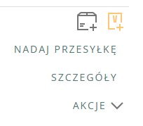

Domyślnie do wyboru jest kilkanaście predefiniowanych kolorów, ale można też wybrać dowolny, przy czym wymagana będzie wtedy dodatkowa czynność - szczegóły po wybraniu koloru spoza palety domyślnych.
   
  

### Automatyczne pobieranie i drukowanie etykiet adresowych  

Upraszcza i skraca czas potrzebny na pobranie i wydrukowanie etykiety adresowej. Po kliknięciu "Nadaj przesyłkę" zamiast wykonywania kilku czynności:

- kliknięcie przycisku "Zapisz"
- kliknięcie przycisku "Zamów przesyłki"
- rozwinięcie menu i wybranie pozycji "Pobierz etykietę"
- otwarcie pobranej etykiety
- wydruk etykiety
- zamknięcie pobranej etykiety
- usunięcie pobranej etykiety

wystarczy kliknięcie przycisku "Zapisz i drukuj". Wszystkie te czynności zostaną wykonane automatycznie, bez zbędnej zwłoki i angażowania twojej uwagi, w międzyczasie możesz zająć się czymś innym, np. zaklejaniem paczki.

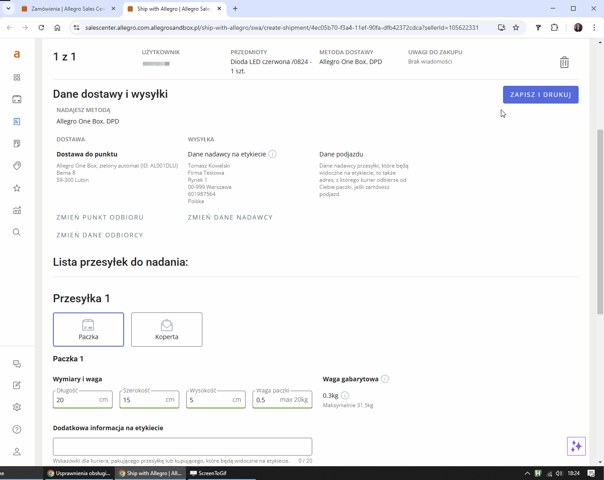

Moduł ten wymaga dwóch dodatkowych programów:

- SumatraPDF: program do obsługi plików PDF z opcją drukowania z wiersza poleceń, do pobrania [tutaj](https://www.sumatrapdfreader.org/download-free-pdf-viewer)
- allegro_extensions.exe: program łączący to rozszerzenie z systemem operacyjnym użytkownika - celem wykrywania listy drukarek i drukowania pobranych etykiet za pomocą programu SumatraPDF, do pobrania z listy plików widocznej powyżej jako "allegro_extensions_drukowanie.zip" 

Przed aktywowaniem tego modułu zainstaluj program SumatraPDF oraz uruchom program "allegro_extensions.exe"

Pojawi się informacja o tym że program nie jest zarejestrowany w systemie

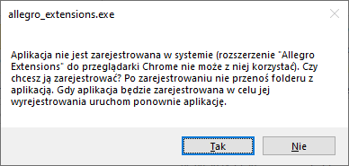

Kliknij "Tak". Pojawi się kolejne pytanie o ID rozszerzenia

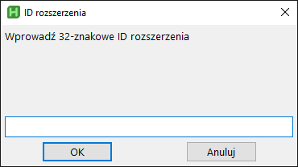

Jest ono unikalne, znajdziesz je na stronie rozszerzeń

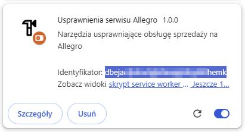

Zaznacz i skopiuj ten identyfikator, wklej go i kliknij OK. Otrzymasz potwierdzenie zarejestrowania aplikacji w systemie

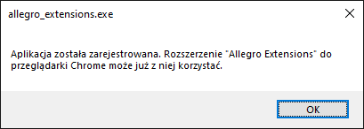

Po wykonaniu tych czynności możesz włączyć moduł na stronie opcji rozszerzenia. Wskaż drukarkę która będzie służyć do wydruku etykiet adresowych. Ścieżka do programu SumatraPDF, jeśli został zainstalowany w domyślnej lokalizacji, uzupełni się automatycznie. Jeśli nie - wskaż ją we właściwym polu i kliknij "Zapisz".

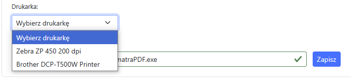

Po kliknięciu przycisku "Nadaj przesyłkę" na liście zamówień w Sales Center w formularzu nadawania przesyłki pojawią się dwa przyciski "Zapisz i drukuj", na górze oraz na dole strony, obok przycisku "Zapisz". Przycisk na górze przydaje się zwłaszcza na małych monitorach żeby nie trzeba było przewijać strony na dół.

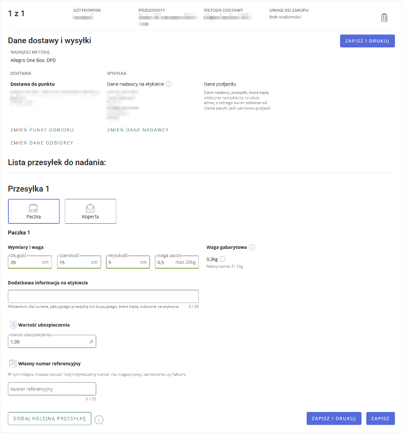

Po kliknięciu tego przycisku wszystkie czynności związane z pobieraniem i wydrukiem etykiety zostaną wykonane automatycznie. Sporadycznie może się zdarzyć, że program nie wykryje zakończenia momentu pobierania - pojawi się wtedy okno z komunikatem "Nie wykryto zakończenia pobierania w sposób automatyczny w ustalonym okresie czasu. Ostatnio znaleziony pobrany plik to (nazwa pliku). Upewnij się że jest to plik z etykietą którą chcesz wydrukować a nie plik wcześniejszy. Czy wydrukować?" Sprawdź czy jest to etykieta którą chcesz wydrukować i zatwierdź. Zauważyłem że dzieje się to głównie wtedy gdy strona Allegro trochę zwalnia z powodu obciążenia (koło godz. 14-15) albo przy wydruku pierwszej etykiety po uruchomieniu komputera. Raz na jakiś czas (co miesiąc albo nawet rzadziej) warto kliknąć "Wyczyść wszystko" na stronie historii pobierania.

Aby uniknąć omyłkowego wydruku tej samej etykiety, po wydruku przycisk "Nadaj etykietę" na stronie Sales Center przy danym zamówieniu zostanie zablokowany.

Moduł ten działa tylko dla pojedynczych przesyłek. W przypadku korzystania z opcji "Nadaj wiele", przycisk "Zapisz i drukuj" nie będzie widoczny na stronie.
   
  

### Wypełnianie wagi i wielkości przesyłki

Pozwala automatycznie wypełnić pola dotyczące wielkości przesyłki (lub zaznaczyć odpowiednią wielkość). Definiowane osobno dla każdej formy dostawy. Dla przesyłek których wymiary podaje się ręcznie, nie z wybieralnej listy, dodaje dodatkowo opcje do 9 szablonów których kliknięcie szybko wstawi dane wartości do pól dotyczących wielkości przesyłki. Ponadto długie przytrzymanie przycisku danego szablonu (lub wybieralnej predefiniowanej opcji) oznaczy ten szablon (tą opcję) jako domyślną.

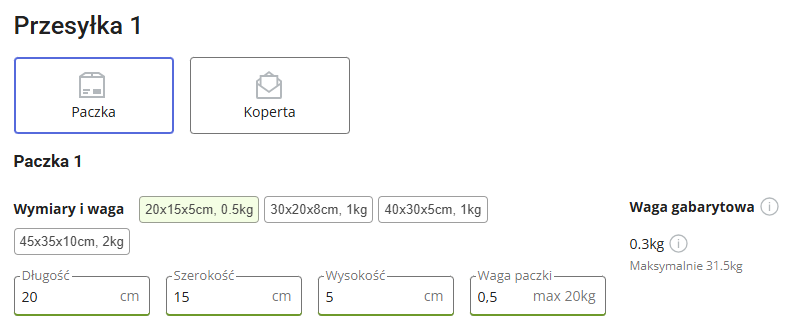

Moduł ten działa również przy nadawaniu wielu przesyłek jednocześnie przy użyciu przycisku "Nadaj wiele", nie uwzględnia jednak dodatkowych przesyłek w ramach jednego zamówienia - po kliknięciu przycisku "Dodaj kolejną przesyłkę".

Na stronie opcji rozrzerzenia trzeba skonfigurować wartości domyślne. W przypadku wartości których wymiary podaje się w polach długość, szerokość, wysokość i waga - należy wpisać je w odpowiednich polach i kliknąć "Zapisz", lub dodać kolejne szablony jeśli planujemy korzystać z większej liczby rozmiarów przesyłek przy nadawaniu. W momencie zapisywania szablon który był zaznaczony staje się szablonem domyślnym. W przypadku przesyłek które posiadają predefiniowane wymiary - należy zaznaczyć domyślną opcję i kliknąć "Zapisz".

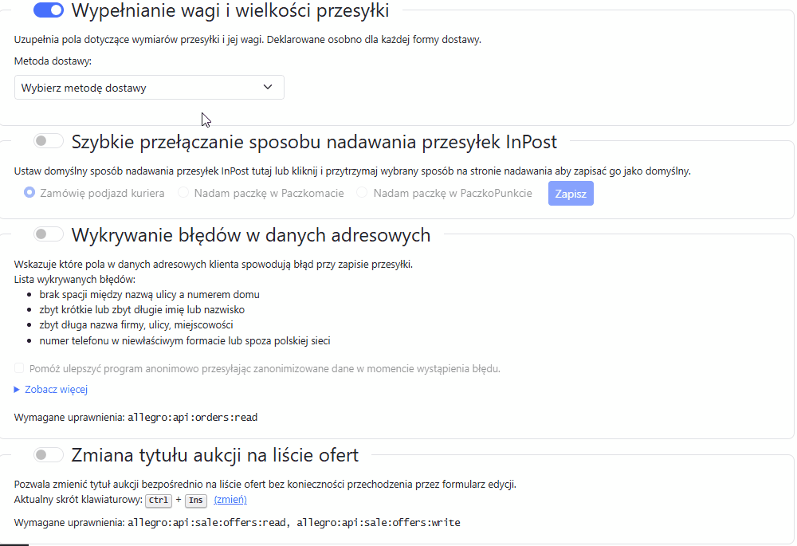

Na liście metod dostawy dodane są najpopularniejsze opcje dostawy. Ograniczenia dotyczące wartości maksymalnych i minimalnych dla danych form dostawy mogą się okresowo zmieniać, jeśli wpiszesz wartości które przy wprowadzaniu w ustawieniach mieściły się w dopuszczalnym przedziale ale przy nadawaniu dają błąd za mały lub za duży wymiar - daj znać, postaram się je poprawić. Można dodawać nowe metody, których nie ma ma liście, wybierając wartość "Dodaj nową". Następnie należy wybrać czy będzie to metoda dostawy w której podaje się wartości numeryczne pól długość, szerokość, wysokość i waga, czy wybiera się z listy. 

W przypadku wartości numerycznych, postępuj tak jak wcześniej przy uzupełnianiu domyślnych wartości.

W przypadku wartości predefiniowanych, rozwiń menu klikając strzałkę obok przycisku "Zapisz" i wybierz "Dodaj wybieralną pozycję". W formularzu "Wysyłam z Allegro" zaznacz nazwę przy danej predefiniowanej wartości, skopiuj ją

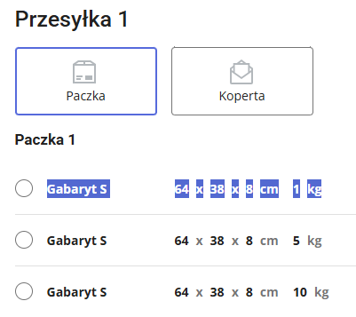

a następnie kliknij tekst "Kliknij tutaj aby wkleić ze schowka skopiowany tekst". Tak naprawdę wklejona nazwa nie ma znaczenia - liczy się która w kolejności jest to pozycja. Moduł nie zaznacza wyszukując po nazwie, tylko po numerze. Jeśli np. korzystasz tylko z pierwszych 3 opcji, nie musisz dodawać kolejnych. Jeśli jednak korzystasz np. tylko z ostatniej opcji, musisz dodać też wszystkie wcześniejsze. Pamiętaj że jeśłi zmieni się liczba tych opcji (mało prawdopodobne) będzie trzeba zmienić też to w ustawieniach.

Dla nowo dodawanych metod dostawy nie ma ograniczeń dotyczących wymiarów i wagi (można wpisać od 1 do 999). Ponadto jeśli zmienisz nazwę metody dostawy spośród tych dodanych domyślnie na liście, przestaną obowiązywać ograniczenia dotyczące wymiarów i wagi. Późniejsze przywrócenie tej nazwy do nazwy pierwotnej nie przywróci już tych ograniczeń, tak więc jeśli potrzebujesz wpisać wartości spoza zakresu, zmień tymczasowo nazwę metody dostawy, przywróć ją do poprzedniej wartości i będziesz mógł wprowadzić dowolne wartości z zakresu od 1 do 999.

Nazwa metody dostawy musi być dokładnie tą nazwą, która widnieje w formularzu nadawania w polu "Metoda dostawy". Najlepiej zaznacz ją, skopiuj i wklej. To tej nazwy moduł używa do rozpoznania z jaką formą dostawy ma do czynienia na stronie formularza "Wysyłam z Allegro".

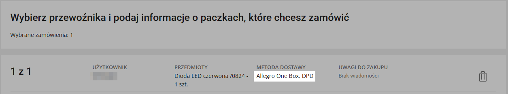

Przy nadawaniu do pól wstawiane są wartości domyśłne (lub zaznaczana jest domyślna opcja). Aby wstawić inne wartości, kliknij nazwę szablonu. Aby ustawić dany szablon jako domyślny, możesz kliknąć i przytrzymać daną nazwę szablonu (lub wybieralną opcję) aż podświetli się na zielono. Możesz też zmienić to w ustawieniach zaznaczając odpowieni szablon (opcję) i klikając "Zapisz".

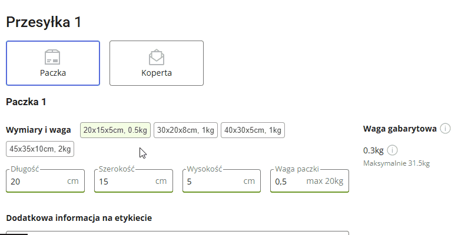  

Allegro wprowadziło w dn. 08.07.2025 r. podpowiadanie wagi przesyłki oparte na AI, zmieniając też trochę layout strony. Moduł został zaktualizowany do nowego layoutu. Gify prezentujące działanie modułu przedstawiają jeszcze stary wygląd, możliwe że coś się wkrótce zmieni tak więc póki co nie aktualizuję dokumentacji w tym zakresie. Jeśli chcesz korzystać z podpowiadania oferowanego przez Allegro - ustaw wagę na 0.

   
   

### Szybkie przełączanie sposobu nadawania przesyłek InPost

Zaznacza automatycznie wybrany sposób nadania przesyłki InPost: 
- Nadam przesyłkę z podjazdem kuriera InPost  
- Nadam przesyłkę w Paczkomacie InPost  
- Nadam przesyłkę w PaczkoPunkcie InPost

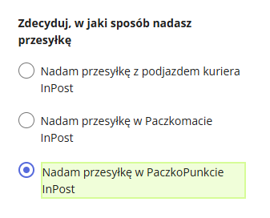

Zmiany domyślnej opcji możesz dokonać w ustawieniach rozszerzenia lub klikając i przytrzymując wybraną opcję na stronie "Wysyłam z Allegro" aż podświetli się na zielono.

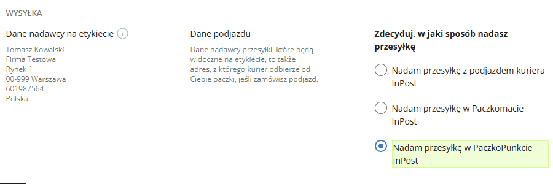

Moduł ten działa również przy nadawaniu wielu przesyłek jednocześnie przy użyciu przycisku "Nadaj wiele".
   
   

### Szybkie wysyłanie nowej wiadomości do kupującego

Dodaje nowy przycisk do menu "akcje" na stronie "zamówienia" oraz na stronie "zwroty" w Wysyłam z Allegro.

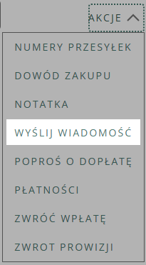

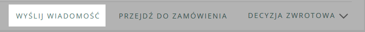

Kliknięcie tego przycisku otworzy w nowej karcie stronę wysyłania nowej wiadomości z uzupełnionymi polami "Login odbiorcy" oraz "Numer zamówienia".

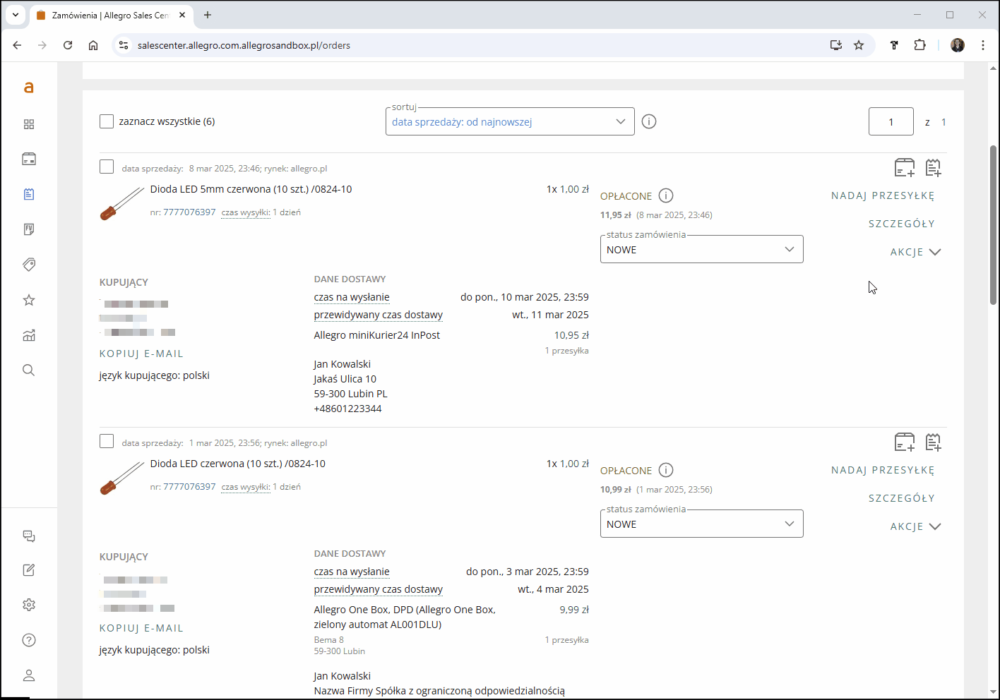

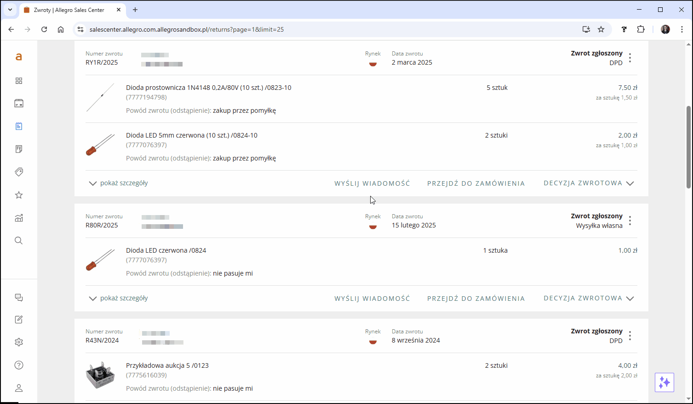
   
   

### Dodatkowe opcje sortowania zamówień

Dodaje nowe opcje sortowania zamówień. Na obecną chwilę jest to sortowanie według liczby pozycji rosnąco. 

Wybranie dodatkowej pozycji "ilość pozycji: rosnąco" z rozwijalnej listy "sortuj" posortuje zamówienia według liczby pozycji w kolejności rosnącej. Sortowane są tylko zamówienia na danej stronie, tak więc jeśli masz zamówienia na drugiej albo kolejnych stronach - nie zostaną one uwzględnione przy tym sortowaniu.

Zauważ że po kliknięciu opcji której nie ma normalnie w rozwijalnym menu nie zmieni się parametr w adresie strony. Odświeżenie strony lub wybranie np. dodatkowych opcji z listy filtrów już po sortowaniu przywróci domyślny sposób wyświetlania. Używaj opcji sortowania na samym końcu, po ewentualnym zastosowaniu pozostałych filtrów.

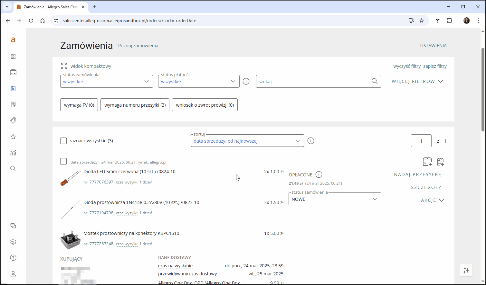
   
   

### Wykrywanie błędów w danych adresowych

Allegro zezwala kupującym na wprowadzanie danych, które przy próbie zapisania przesyłki spowodują wystąpienie błędu. Należą do nich m.in.
- brak spacji między nazwą ulicy a numerem domu
- zbyt krótkie lub zbyt długie imię lub nazwisko
- zbyt długa nazwa firmy, ulicy, miejscowości
- numer telefonu w niewłaściwym formacie lub spoza polskiej sieci

Moduł ten wykrywa wystąpienie błędnych danych i automatycznie otwiera okno ich edycji ze wskazaniem co należy zmienić aby uniknąć błędu podczas zapisywania przesyłki. Niestety kombinacji jest bardzo dużo - każdy przewoźnik ma swoje ograniczenia, ponadto czasami ulegają one zmianie. Jakiś czas temu sporo z tych ograniczeń zostało usuniętych, tak więc restrykcje zostały całkiem nieźle poluzowane, dalej jednak występują.

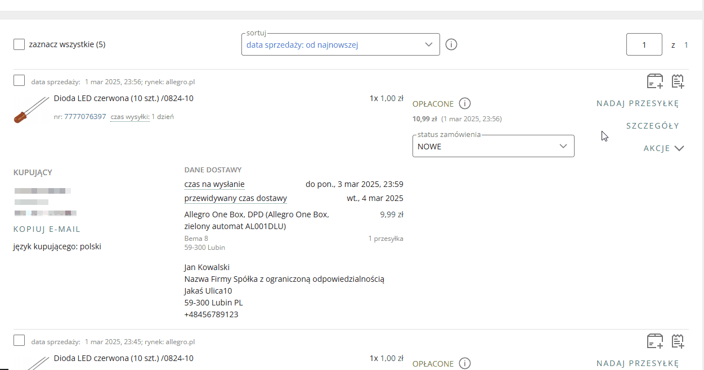

Moduł posiada opcję która przyda mi się przy usprawnianiu działania tego narzędzia - anonimowe wysyłanie zanonimizowanych danych w momencie wystąpienia błędu. Działa to na zasadzie przesyłania informacji o metodzie dostawy oraz próbki danych w których dane klienta zostały zastąpione jedynie informacją z ilu znaków i jakiego rodzaju (litery, cyfry, polskie znaki lub pozostałe znaki) się one składają, np.

| Imię i nazwisko | JanKowalski      | Imię i nazwisko | LLLLLLLLLLL      |
|-----------------|------------------|-----------------|------------------|
| Nazwa firmy     | -                | Nazwa firmy     | -                |
| Ulica i numer   | Błędna1/2        | Ulica i numer   | LLALLLN/N        |
| Kod pocztowy    | 59-300           | Kod pocztowy    | NN-NNN           |
| Miejscowość     | Lubin k. Legnicy | Miejscowość     | LLLLL L. LLLLLLL |
| Kraj            | Polska           | Kraj            | PL               |
| Telefon         | +48601234567     | Telefon         | +NNNNNNNNNN      |

Próbka taka w momencie wystąpienia błędu podczas zapisywania przesyłki zostanie wysłana do mojej bazy danych, dzięki czemu będę mógł znaleźć odpowiednie wzorce powodujące wystąpienie błędów i usprawnić działanie rozszerzenia. Jeśli chcesz mnie w tym wesprzec - zaznacz opcję "Pomóż ulepszyć program anonimowo przesyłając zanonimizowane dane w momencie wystąpienia błędu."

Moduł ten działa również przy nadawaniu wielu przesyłek jednocześnie przy użyciu przycisku "Nadaj wiele".

Ten moduł korzysta z API. Wymagane uprawnienia: ``allegro:api:orders:read``
   
   

### Zmiana tytułu aukcji na liście ofert

> [!NOTE]
> Główna funkcjonalność tego modułu została niedawno zaimplementowana na Allegro, można jednak używać go w dalszym ciągu aby poszerzyć kolumnę z tytułem aukcji. 

Pozwala zmienić tytuł aukcji bezpośrednio na liście ofert bez konieczności przechodzenia przez formularz edycji. Przydatne zwłaszcza gdy chcesz zmienić wiele tytułów aukcji w krótkim czasie lub znajdziesz błąd w tytule i chcesz szybko go poprawić. Oprócz tego poszerza trochę kolumnę z tytułem aukcji aby nie skracało tekstu gdy tytuł ten jest bardzo długi, zbliżony do maksymalnego limitu znaków.

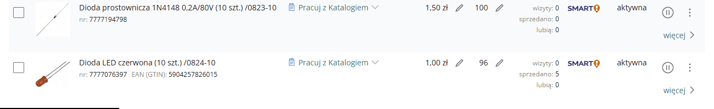

W celu zmiany tytułu, najedź na niego, wciśnij zdefiniowany skrót klawiaturowy (domyślnie <kbd>Ctrl</kbd> + <kbd>Ins</kbd>), po edycji zatwierdź przyciskiem lub klawiszem <kbd>Enter</kbd>. Aby anulować możesz kliknąć przycisk anulowania, kliknąć gdziekolwiek poza polem edycji lub wcisnąć klawisz <kbd>Esc</kbd>. Moduł sprawdza na bieżąco czy tytuł jest poprawny (długość tekstu nie przekracza 75 znaków, nie zawiera znaków typu emoji lub dwóch spacji pod rząd).

Ten moduł korzysta z API. Wymagane uprawnienia: ``allegro:api:sale:offers:read, allegro:api:sale:offers:write``
   
   

### Szybka zmiana liczby przedmiotów

Pozwala zmienić liczbę przedmiotów na aukcji bez konieczności przechodzenia przez formularz edycji oraz jeszcze szybciej niż przy pomocy edycji za pomocą ołówka obok liczby sztuk. Wystarczy najechać na liczbę sztuk i po podświetleniu jej na żółto można dokonać edycji przyciskami lub kółkiem myszki albo kliknąć i wpisać z klawiatury lub zmienić strzałkami na klawiaturze i zatwierdzić przyciskiem lub klawiszem <kbd>Enter</kbd> Aby anulować wystarczy odsunąć myszkę poza obszar wpisywania i przycisków lub w trakcie wpisywania wcisnąć klawisz <kbd>Esc</kbd>.

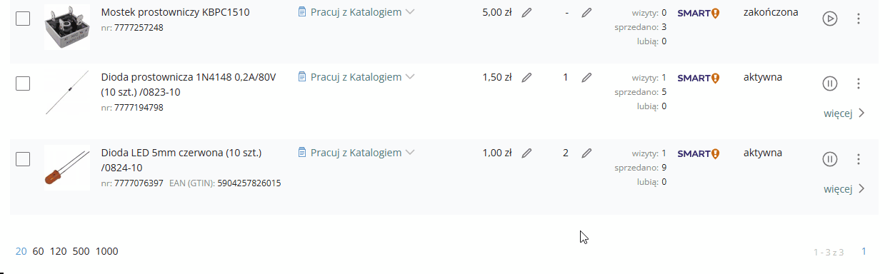

Po prawidłowej zmianie otrzymasz komunikat "Zmieniono" oraz pole zmieni kolor na zielony. Zalecane jest wtedy odświeżenie strony, a to dlatego że jeżeli zmieni się status aukcji (zmniejszysz liczbę do 0, czyli zakończysz aukcję albo zwiększysz ze stanu zerowego, czyli wznowisz aukcję), to stan w kolumnie "status" dalej pozostanie niezmieniony, mimo dokonanej zmiany. Ponadto jeżeli przewiniesz stronę tak że to pole schowa się poza widoczną zawartość strony a następnie przewiniesz z powrotem, to wyświetlona zostanie stara wartość, już bez zielonego koloru.

Ustawienie stanu na 0 zakończy aukcję, zwiększenie stanu w zakończonej aukcji zaś wznowi ją z ustawionym stanem.

Ten moduł korzysta z API. Wymagane uprawnienia: ``allegro:api:sale:offers:read, allegro:api:sale:offers:write``
   
   

### Przywracanie przedmiotów z anulowanego zamówienia

Moduł ten pozwala w łatwy sposób przywrócić stan przedmiotów na aukcjach po anulowaniu zamówienia przez kupującego (lub po automatycznym anulowaniu albo po zwrocie). Jeżeli w sekcji danego zamówienia pojawi się któryś ze zwrotów: "Kupujący anulował", "Kupujący zgłosił zwrot", "Automatyczne anulowanie - informacja", "rabat transakcyjny" to pojawi się dodatkowy przycisk "Przywróć stan".

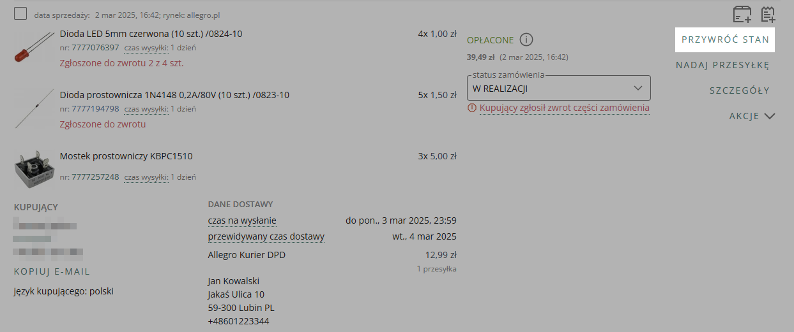

Po jego kliknięciu pojawi się okno z przedmiotami które zostały anulowane (zwrócone) wraz z uwzględnieniem liczby sztuk. Możesz odznaczyć przedmioty których nie chcesz przywracać lub zmienić liczbę sztuk o którą ma zmienić się stan magazynowy na aukcji.

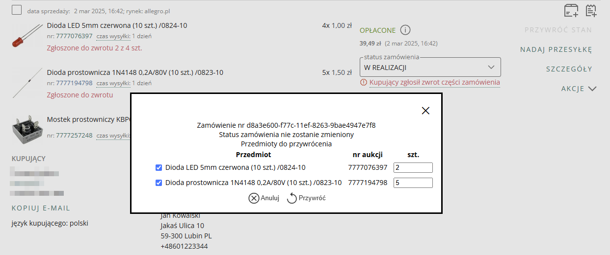

Po kliknięciu przycisku "Przywróć" stan magazynowy przedmiotów na aukcjach zostanie przywrócony. Jeśli zamówienie było anulowane w całości - jego status zostanie ustawiony na "Anulowane". Jeśli zwrot był częściowy, status zamówienia nie zostanie zmieniony. Jeśli aukcja została zakończona z zerowym stanem magazynowym (wyprzedano wszystkie przedmioty), zostanie ona wznowiona. Jeśli aukcja została zakończona wcześniej z niezerowym stanem magazynowym, aukcja nie zostanie wznowiona i pojawi się komunikat informujący o tym że taką aukję trzeba wznowić ręcznie.

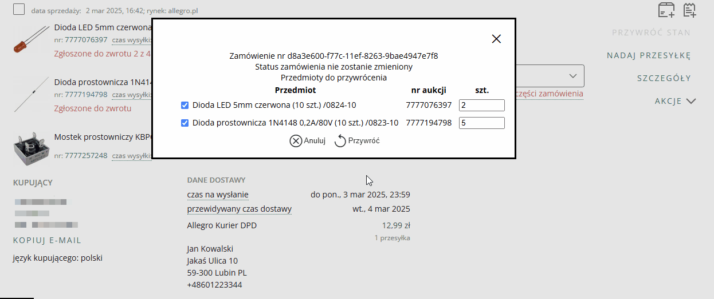

Ten moduł korzysta z API. Wymagane uprawnienia: ``allegro:api:sale:offers:read, allegro:api:sale:offers:write, allegro:api:orders:read, allegro:api:orders:write``
   
   

### Przywracanie przedmiotów z listy zwrotów

Moduł ten pozwala w łatwy sposób przywrócić stan przedmiotów na aukcjach po dokonaniu zwrotu przez kupującego. Jeżeli na stronie listy zwrotów znajdzie się zwrot z ostatnich 60 dni ze statusem "Doręczony" lub "W drodze", w sekcji danego zwrotu pojawi się dodatkowy przycisk "Przywróć stan" (na zdjęciu widoczne jest że pojawia się również dla statusu "Zwrot zgłoszony", jednak jest to tylko tymczasowo na potrzeby przygotowania niniejszej dokumentacji, taki status nie powinien być brany pod uwagę aby nie dokonać zwrotu przedwcześnie).

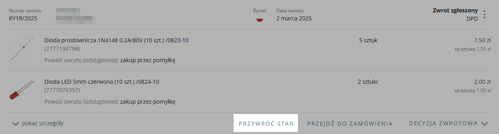

Po jego kliknięciu pojawi się okno z przedmiotami które zostały zwrócone wraz z uwzględnieniem liczby sztuk. Możesz odznaczyć przedmioty których nie chcesz przywracać lub zmienić liczbę sztuk o którą ma zmienić się stan magazynowy na aukcji.

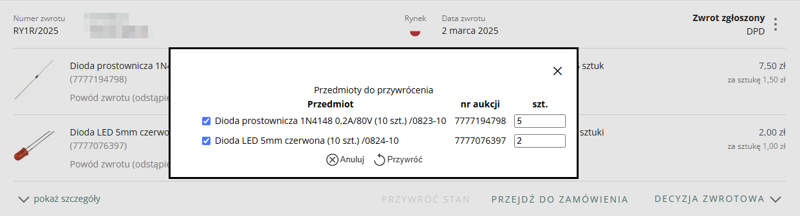

Po kliknięciu przycisku "Przywróć" stan magazynowy przedmiotów na aukcjach zostanie przywrócony. Jeśli aukcja została zakończona z zerowym stanem magazynowym (wyprzedano wszystkie przedmioty), zostanie ona wznowiona. Jeśli aukcja została zakończona wcześniej z niezerowym stanem magazynowym, aukcja nie zostanie wznowiona i pojawi się komunikat informujący o tym że taką aukję trzeba wznowić ręcznie.

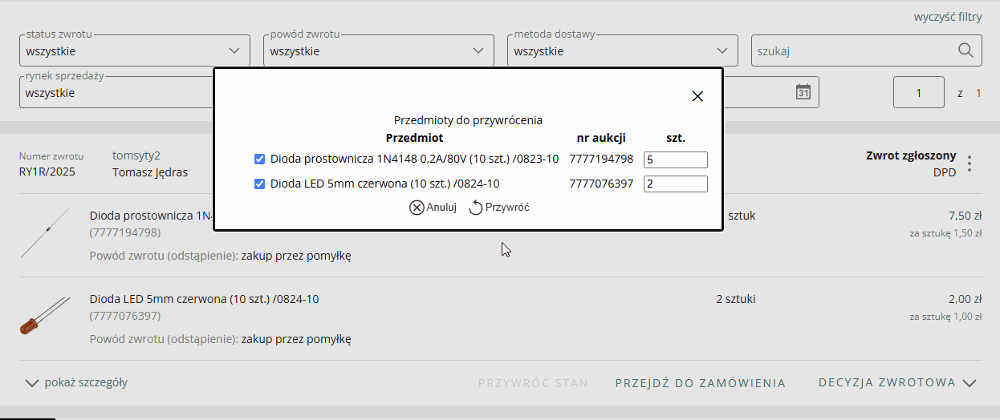

Po kliknięciu przycisku "Decyzja zwrotowa" na liście przedmiotów do zwrotu zostaną zaznaczone te, które klient zaznaczył w formularzu zwrotu, z uwzględnieniem ich liczby sztuk. Na poniższym gifie przedstawione zostanie inne zamówienie niż powyżej - większość dokumentacji szykuję na serwisie testowym, jednak pewnych czynności nie można na nim wykonać, tak więc zostanie przedstawione zamówienie z normalnego serwisu Allegro.

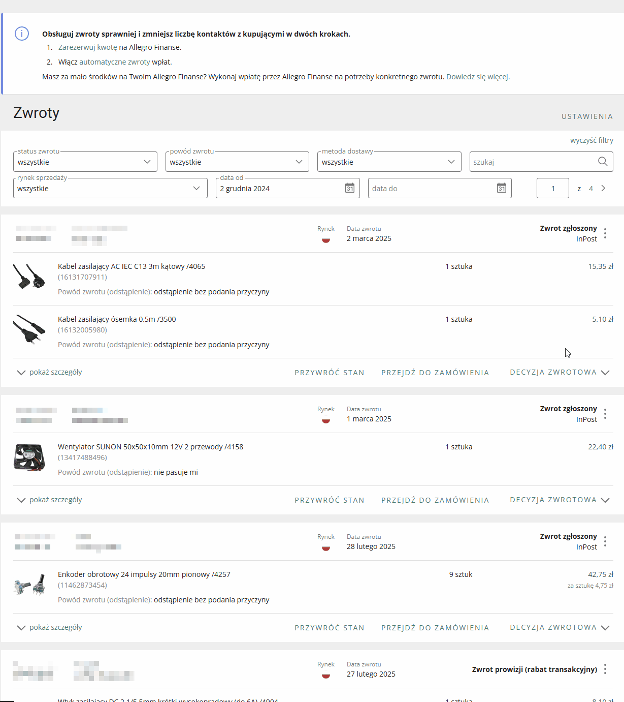

Po zaznaczeniu przedmiotów wskaż decyzję zwrotową i dokonaj zwrotu.

Jeśli korzystasz z serwisu iFirma, jest dodatkowy plus ze stosowania tego modułu. Dla zamówień zwróconych należy wypełnić w tym serwisie protokół zwrotu. Aby zautomatyzować ten proces, możesz zaznaczyć na stronie opcji rozszerzenia opcję "Uzupełniaj pola "Pozycje" na stronie protokołu anulowania sprzedaży w serwisie iFirma". Dzięki temu lista przedmiotów do zwrotu wraz z liczbą sztuk i ceną pojawi się na stronie protokołu anulowania sprzedaży. W tym celu najpierw otwórz stronę iFirma i przejdź do protokołu anulowania sprzedaży, następnie kliknij na liście zwrotów w Allegro dodatkowy przycisk "Protokół anulowania"

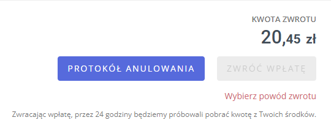

Po jego kliknięciu lista zaznaczonych przedmiotów wraz liczbą sztuk i ceną za szt. zostanie skopiowana na stronę protokołu anulowania sprzedaży

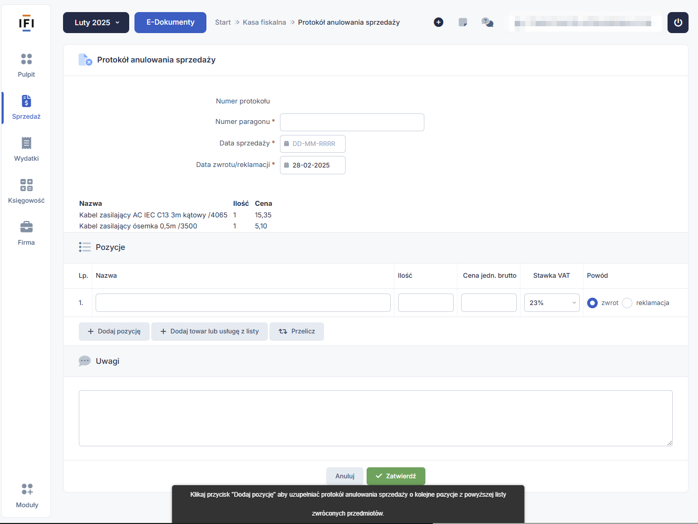

Niestety obecnie nie ma możliwości automatycznego wypełnienia tego formularza, ale jest pewne ułatwienie w jego wypełnianiu. Po przeniesieniu listy przedmiotów na stronę formularza wystarczy po kolei klikać przycisk "Dodaj pozycję". Poszczególne pozycje zostaną zdjęte z listy i podstawione do odpowiednich pól formularza.

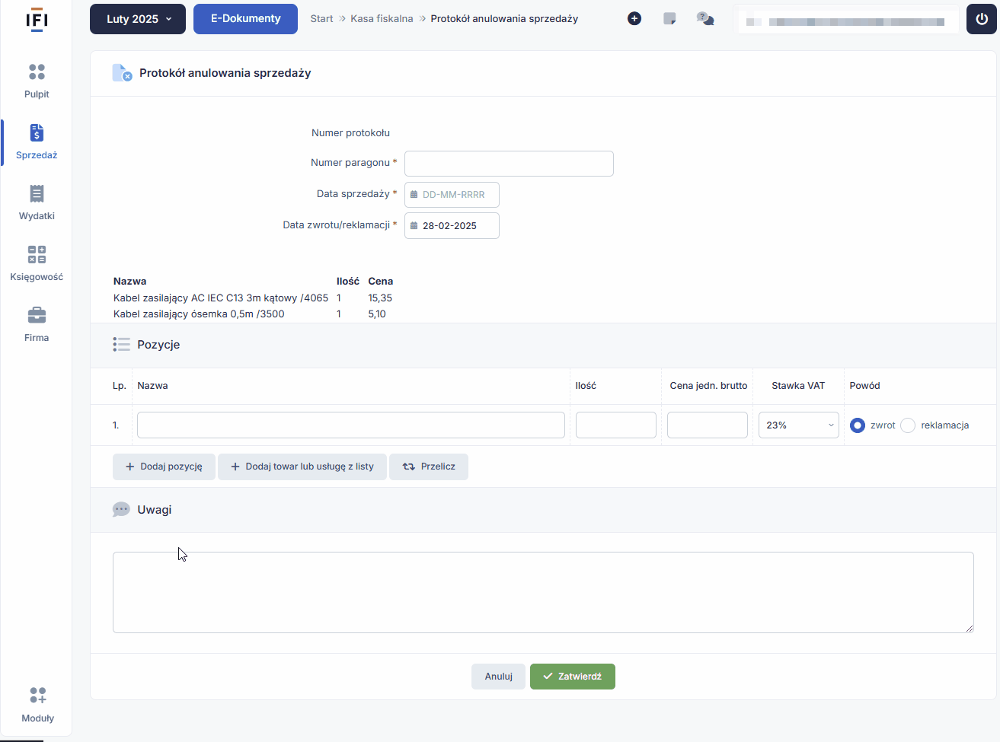

Pracuję jeszcze nad stabilnością tego rozwiązania, ponieważ czasami zdarzy się że po kliknięciu "Dodaj pozycję" pola nie zostaną wypełnione. Trzeba wtedy ponownie otworzyć stronę protokołu anulowania sprzedaży, cofnąć się na liście zwrotów Allegro, kliknąć ponownie przycisk "Decyzja zwrotowa" i przycisk "Protokół zwrotu". Dlatego najlepiej nie klikać przycisku "Zwróć wpłatę", póki nie wypełnisz protokołu anulowania sprzedaży - w przeciwnym wypadku przy ponownym kliknięciu przycisku "Decyzja zwrotowa" zaznaczone do zwrotu przedmioty będą już nieaktywne gdyż zwrot za nie został wykonany tak więc nie będzie można przenieść tych pozycji do protokołu anulowania sprzedaży i trzeba będzie wypełniać go ręcznie.

Ten moduł korzysta z API. Wymagane uprawnienia: ``allegro:api:sale:offers:read, allegro:api:sale:offers:write, allegro:api:orders:read``
   
   

### Pokazuj nazwę produktu na liście ofert

Moduł ten pokazuje nazwę produktu na liście ofert w kolumnie "Katalog produktów Allegro". Dodatkowo pokazuje średnią ocenę produktu wraz z reprezentacją graficzną rozkładu liczby gwiazdek. 

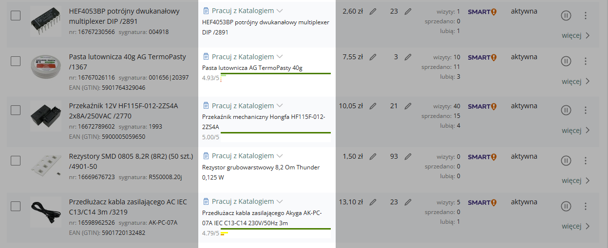

Po najechaniu myszką na wykres graficzny rozkład ten zostanie przedstawiony bardziej szczegółowo.

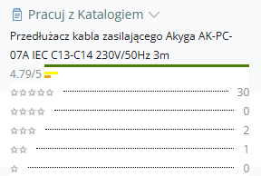

Ten moduł korzysta z API. Wymagane uprawnienia: ``allegro:api:sale:offers:read``
   
  

### Pokazuj tagi ofertowe na liście ofert

Moduł ten pokazuje tagi ofertowe na liście ofert pod numerem aukcji. Tagi ofertowe to tagi które możesz utworzyć na Allegro jeżeli masz wykupiony abonament sklepowy. Pozwalają na zdefiniowanie własnych kategorii produktów i przypisanie ich do poszczególnych aukcji, tagi są wyświetlane po kliknięciu "Wszystkie przedmioty sprzedającego" po lewej stronie pod domyślnymi kategoriami zdefiniowanymi przez Allegro.

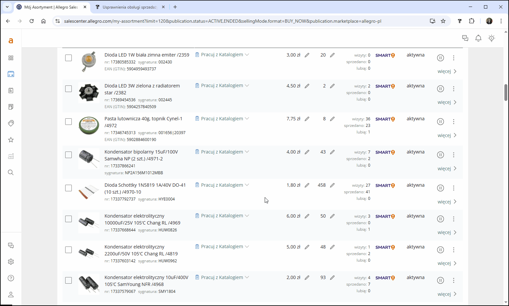

Moduł posiada dodatkową opcję "Domyślnie ukrywaj tagi i pokazuj po wciśnięciu skrótu klawiaturowego", po której zaznaczeniu tagi nie będą domyślnie pobierane ani pokazywane, nastąpi to dopiero po wciśnięciu zdefiniowanego skrótu klawiaturowego. Ponowne jego wciśnięcie ukryje tagi.

Ten moduł korzysta z API. Wymagane uprawnienia: ``allegro:api:sale:offers:read``
   
  

### Pokazuj stan magazynowy i nazwę produktu na liście zamówień

Ten moduł pokazuje stan magazynowy aukcji i nazwę produktu na liście zamówień. Można dzięki temu w łatwy sposób kontrolować stan magazynowy w trakcie pakowania - np. gdy zobaczymy że po spakowaniu przedmiotu którego ostatnią sztukę wyjęliśmy z pudełka pokazuje nam że jest jeszcze kilka sztuk na aukcji, możemy szybko ją zakończyć. Alternatywnie gdy widzimy że została np. jedna sztuka a my mamy ich więcej, możemy szybko zwiększyć ich stan na aukcji. Moduł uwzględnia liczbę sprzedanych sztuk w pozostałych zamówieniach mających status płatności "Opłacone" lub "Płatność za pobraniem", nie bierze pod uwagę zamówień nieopłaconych.

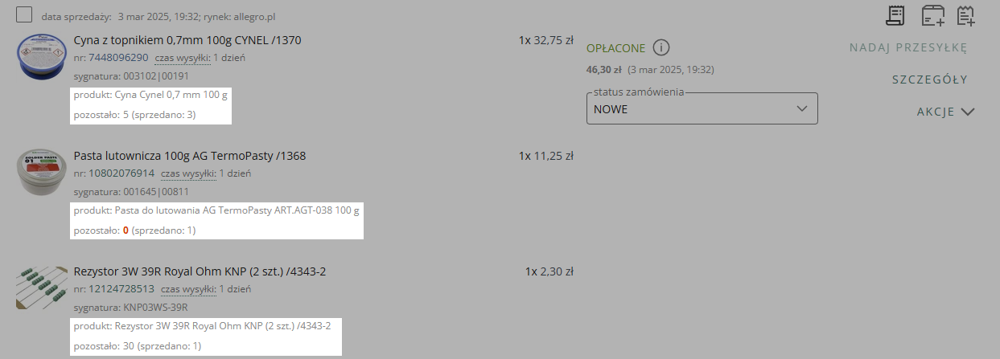

Stan magazynowy możesz zmienić klikając liczbę przy napisie "pozostało:" następnie zwiększyć lub zmniejszyć strzałkami na klawiaturze w górę / w dół i zatwierdzić klawiszem <kbd>Enter</kbd> lub anulować klikając w dowolne miejsce poza tą liczbą lub klawiszem <kbd>Esc</kbd>. Zmniejszenie stanu do 0 spowoduje zakończenie aukcji, zwiększenie stanu z zerowego do większego od zera wznowi aukcję. Wznawianie trwa trochę dłużej niż normalna zmiana.

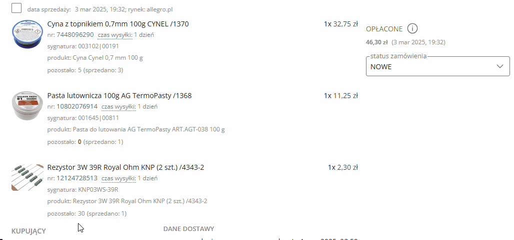

Ten moduł korzysta z API. Wymagane uprawnienia: ``allegro:api:sale:offers:read, allegro:api:sale:offers:write, allegro:api:orders:read``
   
   

### Ostrzegaj przed ponownym wygenerowaniem etykiety oraz sprawdź czy zamówienie nie zostało anulowane

Ten moduł pozwala zorientować się w momencie nadawania, że przesyłka dla danego zamówienia została już utworzona. Przydatne np. gdy kilka osób jednocześnie szykuje zamówienia na różnych komputerach. Pozwala to uniknąć sytuacji gdy zostaną wygenerowane dwie etykiety. Moduł sprawdza w momencie kliknięcia przycisku "Nadaj etykietę", czy do danego zamówienia został przypisany jakiś numer przesyłki. Jeśli tak jest, to na stronie pojawi się komunikat w postaci okna

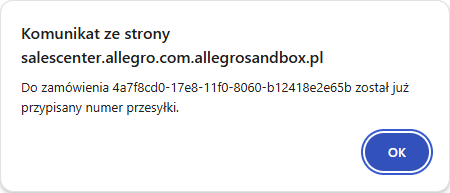  
oraz na dole strony w postaci wiadomości

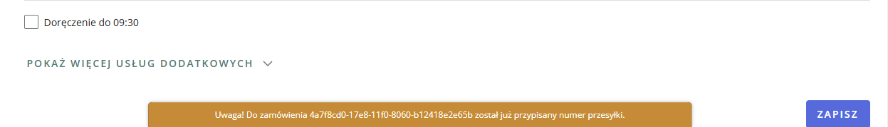

Przycisk "Zapisz" nie będzie jednak zablokowany - czasami zdarzają się sytuacje że się nadać ponowną przesyłkę (np. dosyłając brakujący produkt), tak więc dalej jest taka możliwość.

Jeśli do danego zamówienia nie ma jeszcze wprowadzonego numeru przesyłki, to przycisk "Zapisz" zmieni kolor na zielony - informując tym samym, że moduł dokonał sprawdzenia i nie znalazł żadnego numeru.

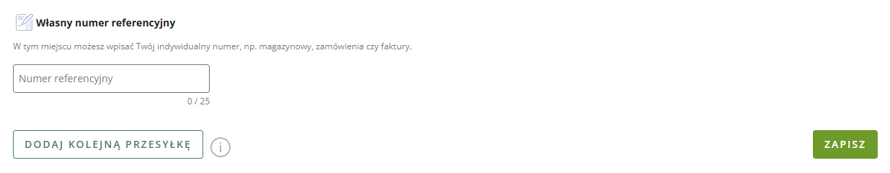

Ponieważ sprawdzanie numeru przesyłki odbywa się w momencie kliknięcia "Nadaj przesyłkę", nie uchroni to przed sytuacją, gdy np. na dwóch komputerach otworzysz stronę nadawania przesyłki, przez parę minut będziesz ją szykował po czym klikniesz "Zapisz". Najlepiej zamawiać przesyłkę klikając "Nadaj przesyłkę" w momencie gdy ma się zamiar wydruku etykiety.

Jeśli korzystasz z modułu "Automatyczne pobieranie i drukowanie etykiet adresowych" możesz jednak uniknąć i tej sytuacji, gdyż w memencie kliknięcia przycisku "Zapisz i drukuj" nastąpi dodatkowe sprawdzenie obecności numeru przesyłki. W razie gdy zostanie on znaleziony, dalsze czynności zapisywania, pobierania i drukowania etykiety zostaną przerwane.

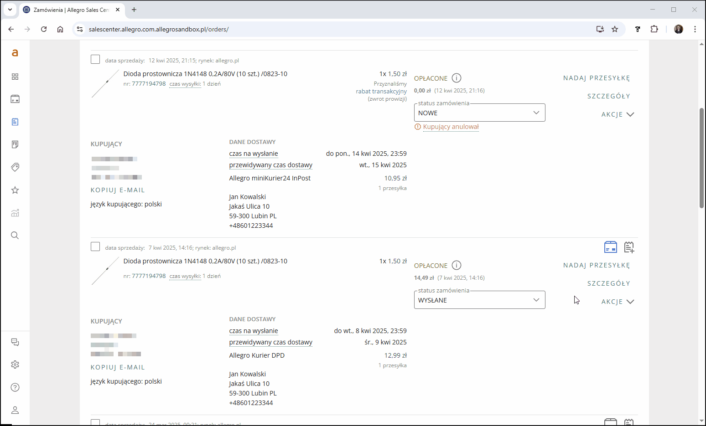

Oprócz tego moduł sprawdza, czy zamówienie nie zostało anulowane. Informacja o anulowaniu zamówienia jest widoczna zarówno na liście zamówień jak i przychodzi mailowo, jednak jeśli masz otwartą listę zamówień szykując przesyłki a kupujący anuluje zamówienie później, gdy już miałeś otwartą stronę, to bez odświeżenia listy zamówień ta informacja nie pojawi się na stronie. Po kliknięciu przycisku "Nadaj przesyłkę" również nie będzie takiej informacji.

Podobnie jak przy sprawdzaniu czy istnieje numer przesyłki, tak dla anulowanego zamówienia pojawi się komunikat w postaci okna

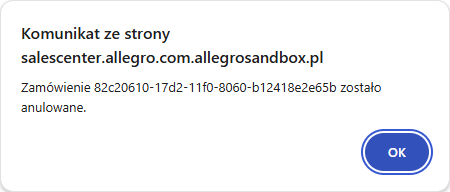  
oraz na dole strony w pojawi się wiadomość

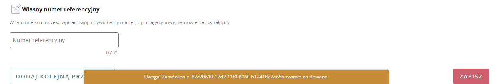

Tym razem jednak przycisk "Zapisz" będzie miał kolor czerwony i nie będzie można go kliknąć. Sprawdzanie czy zamówienie jest anulowane odbywa się w tym samym momencie jak opisano wyżej dla sprawdzania numeru przesyłki. 

Ten moduł korzysta z API. Wymagane uprawnienia: ``allegro:api:orders:read``
   
   

### Pokazuj status przesyłek

Ten moduł pokazuje status przesyłek na stronie "Zamówione przesyłki" w postaci paska postępu o różnych kolorach w zależności od ostatniego zarejestrowanego statusu zamówienia. Sporadycznie w systemie śledzenia przesyłek mogą pojawić się zdarzenia w nieprawidłowej kolejności (np. status "doręczona" a po nim "wydana do doręczenia"), warto mieć to na uwadze.

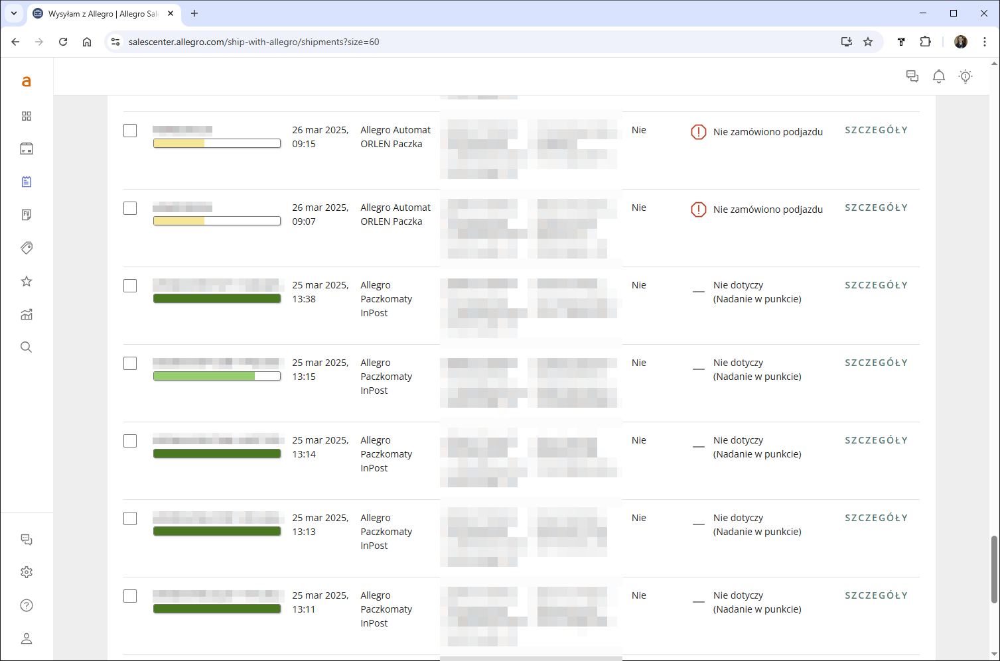

Znaczenie poszczególnych kolorów:

 - przesyłka oczekuje na nadanie  
 - przesyłka w transporcie  
 - przesyłka wydana do doręczenia  
 - przesyłka gotowa do odbioru  
 - przesyłka doręczona  
 - przesyłka awizowana  
 - przesyłka zwrócona  
 - problem z przesyłką

Ten moduł korzysta z API. Wymagane uprawnienia: ``allegro:api:orders:read, allegro:api:shipments:read, allegro:api:shipments:write``
   
  

### Kontroluj parametry produktowe

Ten moduł pozwala zorientować się że w produkcie podpiętym do aukcji dokonano zmiany. W razie jej wykrycia na liście aukcji w kolumnie "Katalog Allegro" pojawi się link "zmiany w produkcie", po wskazaniu którego wyświetli się okno ze szczegółami zmiany.  
Moduł może działać automatycznie co określony okres czasu (1 - 24 godziny) sprawdzając aukcje w tle - przy włączonej przeglądarce, nie musi być uruchomiona strona Sales Center. W razie wykrycia zmian w systemowym centrum powiadomień pojawi się informacja o wykryciu zmian i ich liczbie a w oknie przy ikonie rozszerzenia pojawi się lista aukcji w których dokonano zmian w produktach. Po ich kliknięciu otworzy się strona z daną aukcją w Sales Center, gdzie po wskazaniu linku "zmiany w produkcie" będzie można zapoznać się z tymi zmianami.

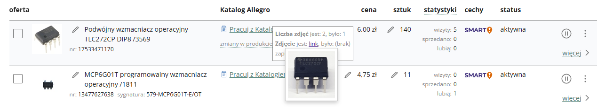

Wykrywane są następujące zmiany:
 - zmiana nazwy produktu
 - zmiana liczby obrazków
 - dodanie / usunięcie obrazków
 - zmiana liczby parametrów
 - dodanie / usunięcie / zmiana parametrów

Jest jeden wyjątek w raportowaniu - nie zostanie uznane za zmianę gdy przy pobieraniu obrazków nie zostanie pobrany żaden obrazek. Może dojść do sytuacji że ktoś usunie wszystkie obrazki z produktu (mało prawdopodobne, jeżeli są już jakieś obrazki, to raczej jakiś musi zostać). Ten wyjątek spowodowany jest tym że Allegro czasami nie zwraca obrazków przy pobieraniu produktu, nie zwraca też błędu. Po prostu zdarza się że występuje tymczasowy problem z serwerem zdjęć i aby uniknąć ogromnej liczby powiadomień o braku obrazka wprowadziłem ten wyjątek.  

W okienku zmian po najechaniu na link obrazka wyświetlana jest miniaturka, po kliknięciu można wyświetlić obraz w pełnym rozmiarze.  

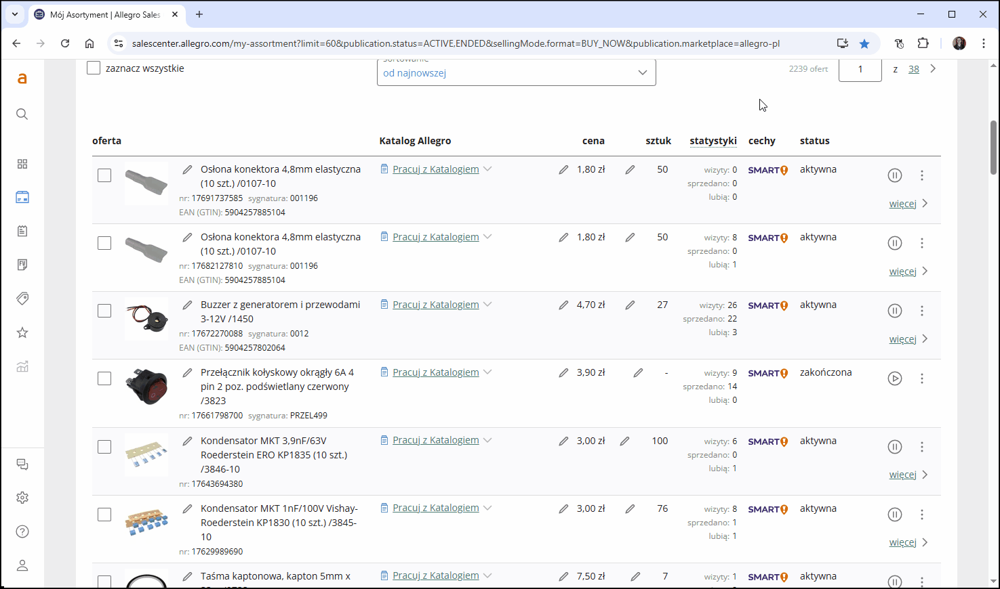

Jeśli uznamy że zgadzamy się ze zmianami, należy kliknąć "zapisz zmiany" w wyświetlanym oknie zmian dotyczącym konkretnej oferty, aby nie otrzymywać kolejnych powiadomień. Jeśli nie, trzeba zgłosić zmianę parametrów produktu i czekać na jej akceptację, w międzyczasie informacje o zmianach będą pojawiać się za każdym razem. 

Aby było co porównywać moduł musi najpierw pobrać listę produktów i ich parametrów i zapisać ją w bazie. W tym celu można kliknąć przycisk "Zbuduj bazę". Jeśli korzystasz z automatycznego sprawdzania produktów w tle nie jest to wymagane, zostaną one zapisane przy pierwszym sprawdzaniu. Podobnie jest z nowo dodanymi ofertami - jeśli szczegóły dotyczące produktu nie są jeszcze zapisane w bazie, to będą, przy pierwszym wyświetleniu oferty na liście "Mój asortyment" w Sales Center lub przy najbliższym automatycznym pobieraniu.  

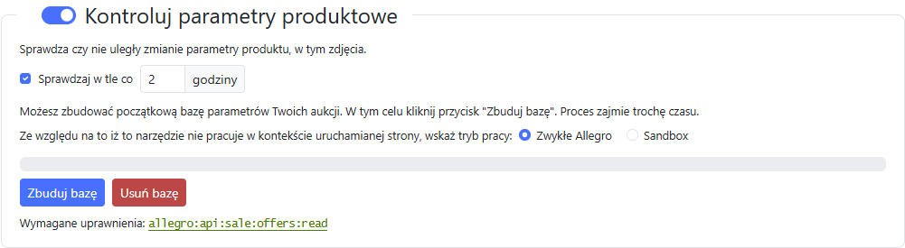

Ponieważ akcja w tle jest inicjowana bez konieczności wchodzenia na stronę Sales Center, rozszerzenie musi wiedzieć czy ma sprawdzać zmiany w normalnym serwisie (domyślnie) czy w serwisie testowym, jeśli chcesz sprawdzić działanie w serwisie testowym, zmień to w ustawieniach.

Po włączeniu opcji automatycznego sprawdzania w tle ikonka rozszerzenia będzie miała dodany symbol zegarka, informując że jest ustawiony alarm. Pierwsze sprawdzenie nastąpi w najbliższej pełnej minucie (lub następnej jeśli zostało mniej niż 30 sekund). Kliknięcie lewym przyciskiem na ikonę rozszerzenia nie będzie wtedy wyświetlać domyślnie ustawień rozszerzenia, lecz okno z wynikami działania i przyciskami pozwalającymi wykonać sprawdzenie na żądanie, odłożyć sprawdzanie o godzinę lub zatrzymać (jeśli jest w trakcie). Gdy sprawdzanie jest w trakcie, ikona pokazuje scrollujący tekst "PW...%" informujący o postępie sprawdzania. Opcje rozszerzenia można wyświetlić przy użyciu pozostałych sposobów (kliknięcie prawym przyciskiem myszy ikony rozszerzenia i wybranie "Opcje", trzykropek na liście rozszerzeń po kliknięciu ikony puzzla i "Opcje" lub na stronie listy rozszerzeń "szczegóły" - "opcje rozszerzeń"). 

Ten moduł korzysta z API. Wymagane uprawnienia: ``allegro:api:sale:offers:read``
   
   

### Akcje Erli

Ten moduł pozwala na kopiowanie aukcji do serwisu Erli.pl oraz synchronizację stanów, cen, całych aukcji. Po zaznaczeniu aukcji na Allegro na belce edycji grupowej pojawia się dodatkowe menu "Erli" z opcjami:
 - Uaktualnij całą aukcję w Erli
 - Uaktualnij stan magazynowy / cenę / stan aukcji w Erli
 - Kopiuj do Erli

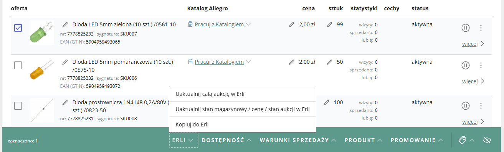  

Możliwe jest zastosowanie zmian w cenach produktów na Erli aby były niższe niż w serwisie Allegro, są do wyboru 3 opcje:
 - obniżka kwotowa (o stałą kwotę)
 - obniżka procentowa (o stały procent)
 - obniżka kwotowa w zależności od kwoty (możliwość ustalenia progów cenowych, po przekroczeniu których cena obniża się o określoną kwotę)

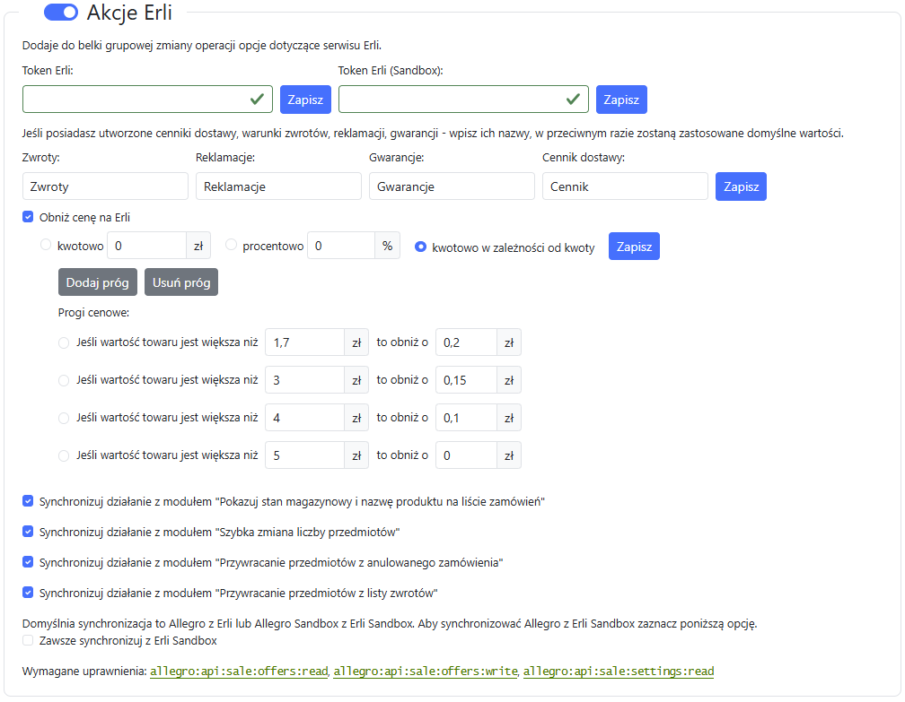

W ustawieniach wymagane jest podanie tokena Erli - uzyskasz go wybierając w ustawieniach sklepu w sekcji "Metoda integracji" - "Własna integracja API"

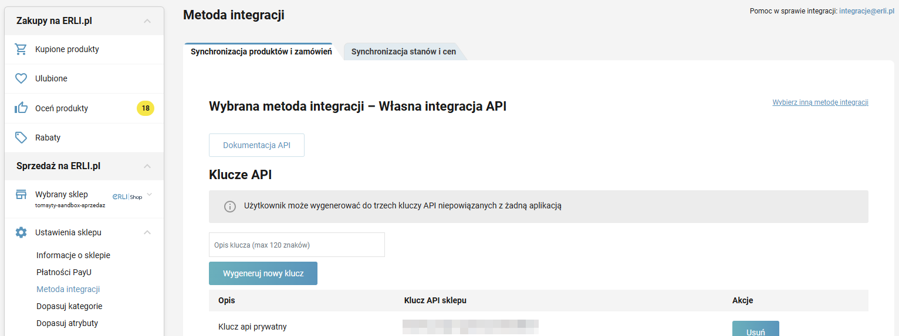

Ponadto wymagane jest podanie nazw identyfikatorów ustawień zwrotów, reklamacji, gwarancji i cennika dostawy z ustawień sklepu Erli

   
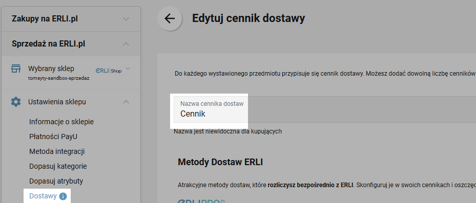  

Moduł jak większość można przetestować w środowisku Sandbox, domyślnie działanie wykonywane na Allegro Sandbox będzie synchronizować działanie z Erli Sandbox, ponadto jest dodatkowa opcja "Zawsze synchronizuj z Erli Sandbox". Jej zaznaczenie pozwoli synchronizować działanie z normalnego Allegro z serwisem testowym Erli Sandbox, dzięki czemu można np. skopiować rzeczywiste aukcje (bez potrzeby wcześniejszego ich tworzenia w serwisie Allegro Sandbox) bezpośrednio na konto testowe w Erli Sandbox.

Kopiowanie aukcji dotyczy tylko samego prostego kopiowania - bez tworzenia ofert wielowariantowych, zestawów, rabatów itp. Ponadto ze względu na występujące czasami różnice w kategoriach w serwisach Allegro i Erli, nie zawsze skopiowane aukcje będą miały przypisaną kategorię - będą wtedy nieaktywne, wymagana będzie ich edycja w Erli i przypisanie właściwych kategorii. Podobnie ma się rzecz z parametrami - czasami w serwisie Erli mogą być wymagane dodatkowe, których nie ma na Allegro, trzeba wtedy dokonać edycji aukcji w Erli aby mogła być aktywna i kupowalna.

Podczas kopiowania producenci i osoby odpowiedzialne są kopiowane do serwisu Erli automatycznie, nie ma potrzeby ich wcześniejszego tworzenia.

Kopiowane są następujące elementy:
- opis
- zdjęcia
- kategoria (nie zawsze uda się przypisać odpowiednią - może być wymagana ręczna edycja, da się grupowo)
- tytuł
- cena (z opcjonalną zmianą jak opisano wcześniej)
- stan magazynowy
- stan aukcji (aktywna / zakończona)
- EAN (tylko pierwszy)
- parametry (w serwisie Erli mogą być dodatkowe obowiązkowe parametry których nie ma w Allegro - może być wymagana ręczna edycja)
- czas realizacji
- typ faktury
- stawka VAT
- producent odpowiedzialny
- osoba odpowiedzialna

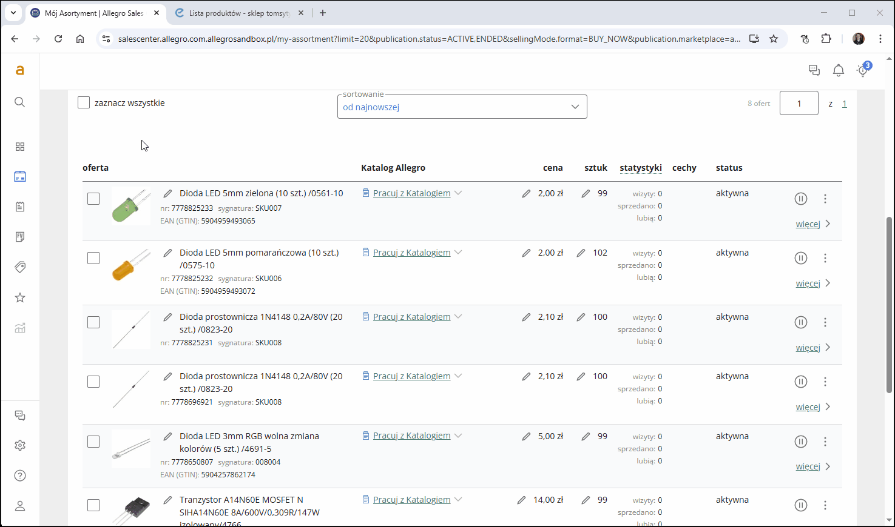

Moduł jest kompatybilny z innymi modułami takimi jak:
 - Pokazuj stan magazynowy i nazwę produktu na liście zamówień (edycja liczby przedmiotów bezpośrednio z poziomu listy zamówień zsynchronizuje również stan w Erli)  
 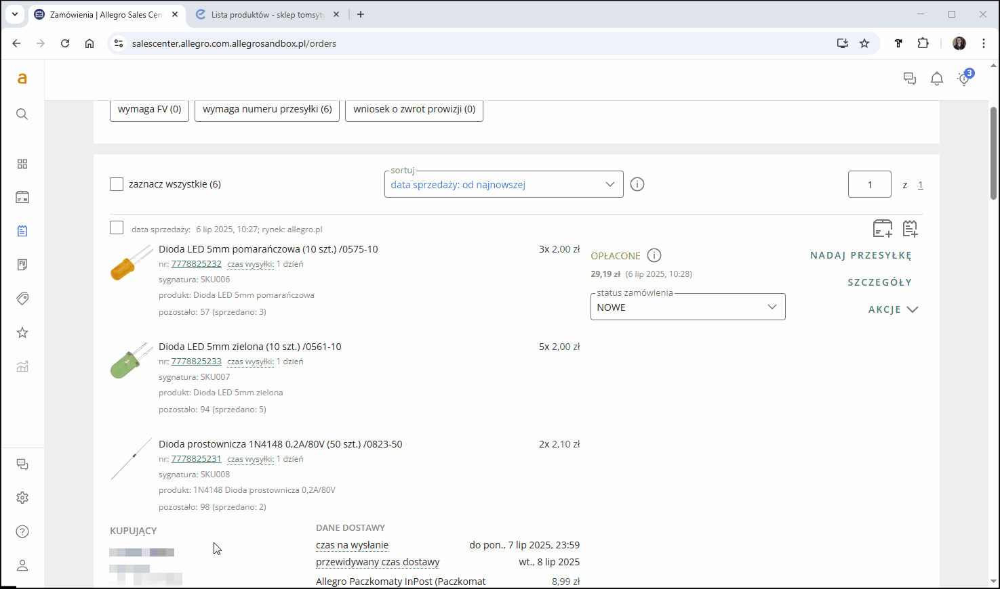
 - Szybka zmiana liczby przedmiotów (edycja liczby sztuk na stronie "Mój asortyment" dokonana w sposób który oferuje ten moduł zsynchronizuje również stan w Erli)  
 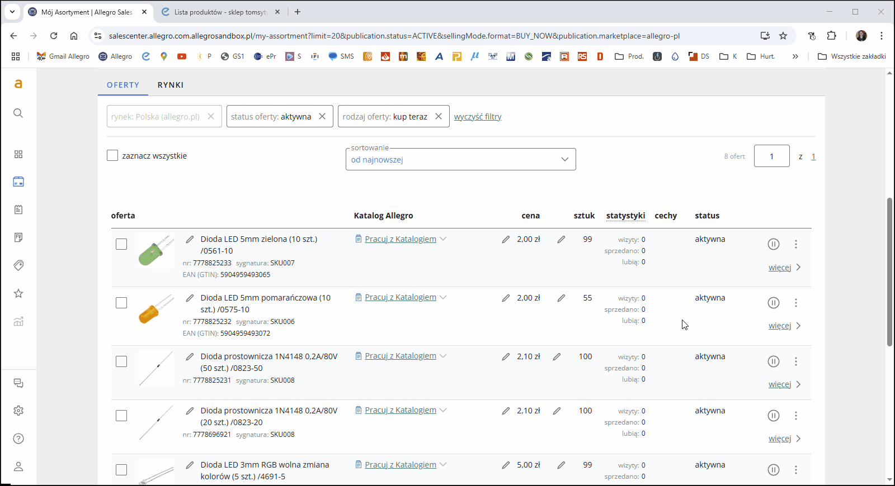
 - Przywracanie przedmiotów z anulowanego zamówienia (przywrócenie zsynchronizuje również stan w Erli)  
 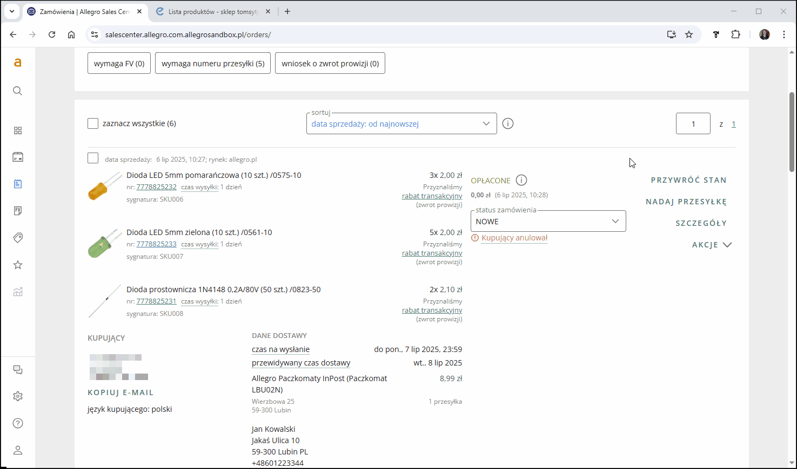
 - Przywracanie przedmiotów z listy zwrotów (przywrócenie zsynchronizuje również stan w Erli)  
 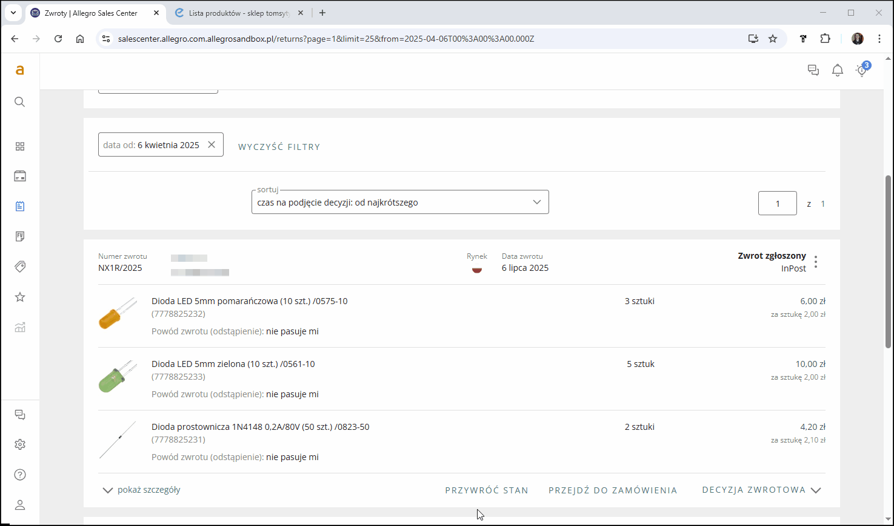

Ten moduł korzysta z API. Wymagane uprawnienia: ``allegro:api:sale:offers:read``
 
 

### Pokazuj statystyki kupujących

Ten moduł pokazuje na stronie "Zamówienia" w sekcji "Kupujący" ile razy dany kupujący dokonał zakupu, na jaką kwotę, ile razy wykonał zwrot, na jaką kwotę. 

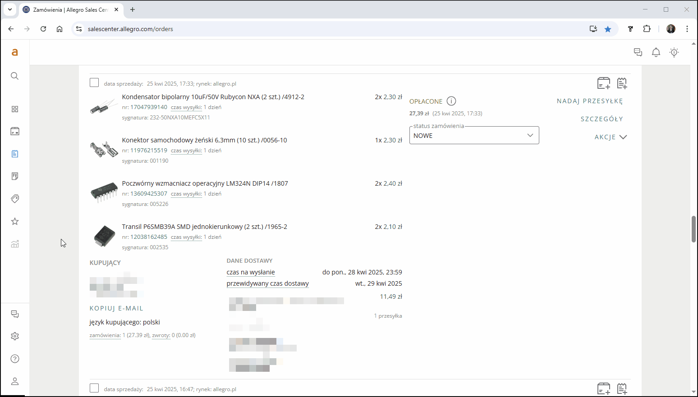

Brane są pod uwagę zrealizowane zamówienia z ostatniego roku (taki okres oferuje wyszukiwarka zamówień na Allegro), zamówienia nieopłacone lub anulowane nie są uwzględniane. Statystyki dla danego kupującego są pobierane, wyświetlane i zapisywane w bazie danych w momencie wyświetlenia zamówienia na stronie (przy przewijaniu listy zamówień, gdy będzie ono widoczne na ekranie), z małym wyprzedzeniem (aby nie było opóźnienia w ich wyświetlaniu). Pozwala to uniknąć niepotrzebnego ponownego sprawdzania wszystkich kupujących będących na stronie listy zamówień po samym tylko otwarciu strony.

Po najechaniu kursorem na tekst "zamówienia" lub "zwroty" pojawi się bardziej szczegółowa ich lista - z datą i kwotą.

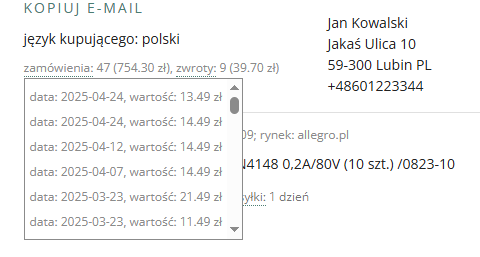

Zamówienia starsze niż rok nie zostaną znalezione, jednak po upływie czasu jeśli będą istnieć w bazie - zostaną uwzględnione. W ten sposób można zbudować historię z okresu dłuższego niż rok. Jeśli chcesz, możesz zbudować początkową bazę z okresu ostatniego roku, zawierającą wszystkie zamówienia i zwroty z tego okresu, aby te informacje nie przepadły. W tym celu na stronie opcji rozszerzenia kliknij przycisk "Zbuduj bazę". Proces ten zajmie trochę czasu, w zależności od liczby zamówień i zwrotów. Każdy krok paska postępu oznacza pobranie i przetworzenie zamówień z jednego dnia.

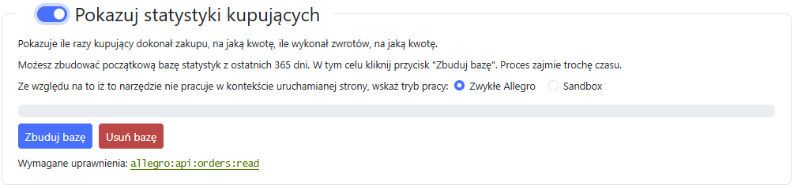

Ten moduł korzysta z API. Wymagane uprawnienia: ``allegro:api:orders:read``
   
  

### Zmień grupowo dodatkowe informacje od sprzedającego

Ten moduł pozwala na grupową zmianę pola "Dodatkowe informacje od sprzedającego" we wszystkich aukcjach. Włącz ten moduł za każdym razem gdy chcesz go użyć, jego stan nie będzie zapisywany. Ponieważ moduł ten nie jest uruchamiany w kontekście strony musisz wskazać czy chcesz dokonać zmiany w normalnym serwisie Allegro czy w serwisie testowym Sandbox.

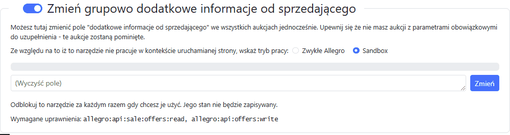

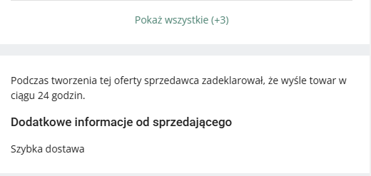

Ten moduł korzysta z API. Wymagane uprawnienia: ``allegro:api:sale:offers:read, allegro:api:offers:write``

***
## Rozwiązywanie problemów

> [!IMPORTANT]
> Jeśli włączysz albo wyłączysz jakiś moduł na stronie opcji rozszerzenia, musisz odświeżyć wszystkie otwarte strony Sales Center.

Najczęstszym problemem z działaniem rozszerzenia jest to, że nie zawsze załaduje się ono na stronie za pierwszym razem. Czasami po uruchomieniu przeglądarki i wejściu na stronę Sales Center rozszerzenie może nie wykonywać swojej pracy, np. jeśli masz włączony moduł "Pokazuj stan magazynowy i nazwę produktu na liście zamówień" - nic takiego się nie pokaże. Spróbuj odświeżyć stronę (<kbd>Ctrl</kbd> + <kbd>F5</kbd>), jeśli dalej nic się nie dzieje - sprawdź konsolę dewelopera (wciśnij klawisz <kbd>F12</kbd>) i odśwież stronę. Sprawdź czy pojawią się wpisy "załadowano skrypt (...)".

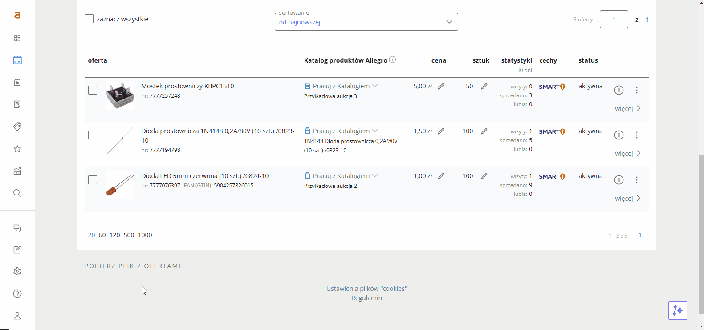

Czasami rozszerzenie może wymagać przeładowania na stronie rozszerzeń. Po przeładowaniu musisz odświeżyć wszystkie otwarte strony Sales Center. Na tej stronie w kafelku rozszerzenia może też pojawić się przycisk "Błędy", gdzie wymienione będą problemy, są to raczej informacje dla programistów a nie użytkowników, ale dla mnie mogą być przydatne w celu znalezienia źródła problemu.

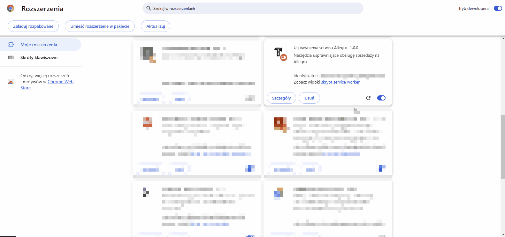

W przypadku modułów korzystających z API błędem może być nie zaznaczenie właściwych uprawnień na stronie [apps.developer.allegro.pl](https://apps.developer.allegro.pl/). Moduły korzystają z minimalnej potrzebnej liczby uprawnień, pamiętaj że jeśli włączysz jakiś moduł i na stronie opcji rozszerzeń dokonasz logowania a następnie włączysz inny moduł korzystający z innych uprawnień, musisz ponownie kliknąć "Zaloguj". Rozszerzenie pokazuje które uprawnienia są przyznane i dodatkowo w momencie włączania rozszerzenia które nie ma jakichś uprawnień pokaże informację o potrzebie ich przyznania i ponownym zalogowaniu.

Nie zmieniaj ikony folderu w którym przechowywane jest rozszerzenie. Jeśli to zrobisz, utworzysz w nim plik "desktop.ini" (ukryty chroniony plik systemowy) który uniemożliwia załadowanie rozszerzenia. Na stronie opcji rozszerzenia przy kafelku z rozszerzeniem pojawi się przycisk "Błędy"

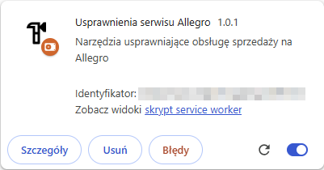

po kliknięciu którego pojawi się lista błędów, a na niej

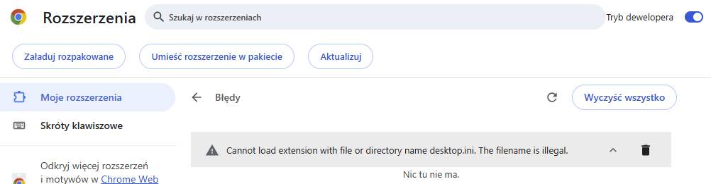

Jak wyłączyć ukrywanie chronionych plików systemu operacyjnego aby móc usunąć plik "desktop.ini"

Aby usunąć plik "desktop.ini" z folderu, trzeba będzie wyłączyć ukrywanie chronionych plików systemowych w eksploratorze Windows - pokazane dla systemu Windows 10. Karta "Widok", na końcu "Opcje" - "Zmień opcje folderów i wyszukiwania", w wyskakującym oknie karta "Widok", w sekcji "Ustawienia zaawansowane" - pozycja "Ukryj chronione pliki systemu operacyjnego (zalecane)".

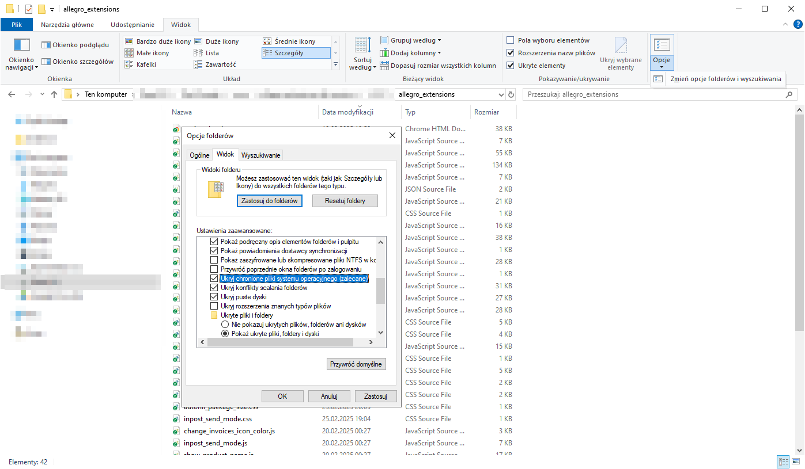

***
Jeżeli napotkasz jakieś błędy w trakcie działania aplikacji, masz jakieś pytania, sugestie, problemy z obsługą, daj znać w sekcji "Discussions".
Jeżeli podoba Ci się moja praca i chcesz aby była dalej rozwijana, możesz wesprzeć mnie dotacją na dowolną kwotę przez PayPal (nie ma potrzeby posiadania konta PayPal): [przekaż donację](https://www.paypal.com/donate/?hosted_button_id=GVU3UC2ZY85SN&locale.x=pl_PL)
